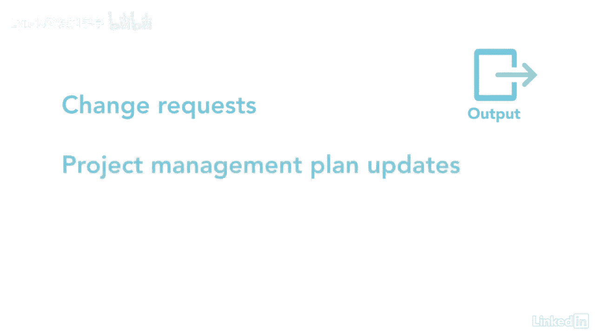

# 061-Lynda教程：项目管理专业人员(PMP)备考指南Cert Prep Project Management Professional (PMP) - P53：chapter_053 - Lynda教程和字幕 - BV1ng411H77g

一旦我确定了项目时间表，我太激动了，我想尽快开始这个项目，这里的关键是确保时间表保持在正轨上，控制计划过程属于监视和控制过程组，它是关于监控项目活动的状态，更新项目进度并管理对计划基线的更改。

按计划进行，请记住，您在监视和控制过程组中的任何时候，你在跟踪计划中的项目和实际的项目，如果有差异，您可能需要提交更改请求以使其回到计划中，以下是这个过程的ittos，大家可以看到。

在这个过程中有很多事情要做，我将详细介绍你在考试中可能看到的内容，让我们从项目管理计划开始，它有一个时间表管理计划，计划范围和性能度量基线计划计划告诉你多久，你要更新时间表，加上它将如何被控制。

基线用于通过测量计划与实际来检查项目绩效，下一个输入是工作绩效数据，这是收集的关于项目绩效的原始数据，项目文件输入包括项目和资源日历，这些数据可用于确定可用于预定活动的工作日和班次。

以及成员何时加入或离开项目，您将使用项目的时间表来监视您的项目，应该是最近有变化的时间表，更新，以及活动是否已经开始或完成，另一个是计划数据，它是描述和控制时间表的信息集合，示例可能包括里程碑。

活动和制约因素，最后是我们在开始这个过程之前应该看的作品，七种工具和技术中的第一种是数据分析，对照基线比较和分析正在进行的工作的实际绩效，有几种方法可以使用，有挣值分析。

它计算调度性能指标或spi和调度方差，或SV，显示与基线的方差水平，然后是趋势分析，看看业绩是否随着时间的推移而变化，然后您可以查看迭代，刻录图表以查看仍需从积压中完成的工作。

接下来是绩效评估和方差分析，定期检查，计划与实际，开始和结束日期，最后完成的百分比，我们有，如果场景查看已识别的风险，以了解它们可能如何影响时间表，会怎么样，关键路径方法允许您查看项目是否偏离了轨道。

PMIS有一个调度软件，用于创建计划，该计划将用于跟踪项目中的差异，其次是资源优化，它使用资源均衡或平滑来确保资源可用于工作，另一个工具是引线和滞后，这可以用来调整计划活动，使计划回到计划中。

另一个工具是使用计划压缩，就像快速跟踪和崩溃，使落后于计划的活动重新保持一致，四个输出中的第一个是工作绩效信息，它告诉您项目是如何根据基线执行的，例如，一个项目是提前了计划还是在预算的目标上。

然后将此信息作为状态更新传达给利益相关者，进度预测是一种用于查看项目未来执行情况的方法，没有任何变化，例如，假设你的项目落后了一天，你可以预测完成时会落后时间表多远，如果没有任何更改。

下一个输出是更改请求，最后两个产出是项目管理计划更新和项目文件更新。

正如你所知，这是一个学习和执行的关键过程，了解时间表中的差异并尽早做出调整是很重要的。