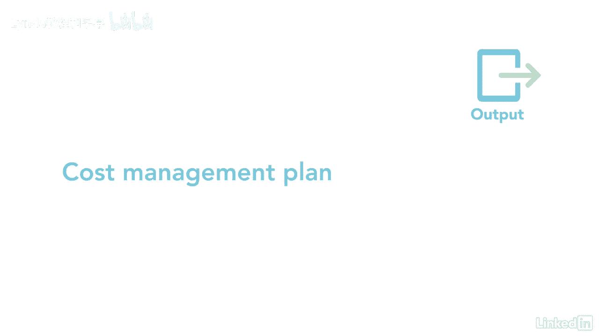

# 061-Lynda教程：项目管理专业人员(PMP)备考指南Cert Prep Project Management Professional (PMP) - P55：chapter_055 - Lynda教程和字幕 - BV1ng411H77g

每当我亲自教课的时候，我必须估计与之相关的成本，喜欢场地，食品书籍和费用，只有在那之后，我才知道举办这次活动需要多少钱，怎样才能打破，就连我也把这些信息编入预算，这样我就可以跟踪我的成本，直到课程结束。

这类似于我们在成本管理计划中所做的，成本管理是一个重要过程，因为你说明了你将如何估计项目的成本，然后制定预算，最后你会控制成本，此过程属于规划过程组，并定义如何估计项目成本，编入预算，管理、监测和控制。

成本管理计划，提供有关如何管理此知识区域中其余流程的详细信息，以下是这个过程的ittos，让我们回顾一下你在考试中最有可能看到的，对这一过程的一个主要投入是项目章程，章程规定了用于成本的高水平预算。

此外，它详细说明了用于管理项目的项目批准要求，下一个主要的投入是项目管理计划，它有时间表管理计划，我们将把费用分配给，还有风险管理计划，取决于如何减轻风险，可能会增加成本，另外两个输入是和opas。

三种工具和技术，专家判断，数据分析，会议都是我们以前见过的，经常与专家会面以获得成本估计，并考虑其他方法来资助这个项目和获得资源，成本管理计划是这一过程的唯一产出，并成为项目管理计划的组成部分之一。

它描述了如何规划项目成本，结构化和可控化，记住计划。