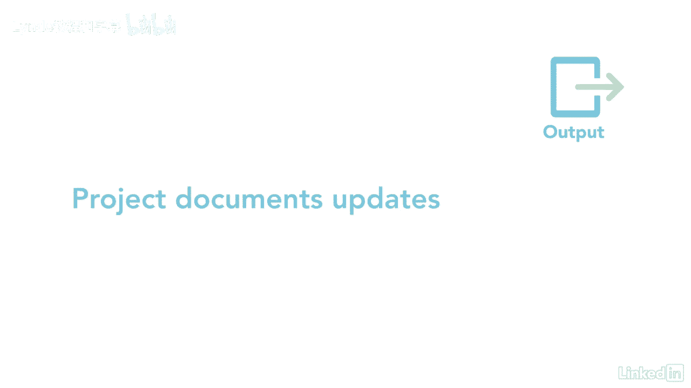

# 061-Lynda教程：项目管理专业人员(PMP)备考指南Cert Prep Project Management Professional (PMP) - P56：chapter_056 - Lynda教程和字幕 - BV1ng411H77g

现在你有了一个项目时间表，知道所有这些工作将再次花费多少钱是很重要的，这是项目的一个关键过程，因为适当地详细说明了项目成本，确保您在整个项目生命周期中有足够的资金，当我们开始这个过程时。

查看估计成本讲义，它有很多信息将帮助您理解这个过程，估计费用过程属于规划过程组，这是您评估项目所需的每种资源的成本的地方，以下是这个过程的ittos，让我们回顾一下你在考试中最有可能看到的。

第一个投入是成本管理计划，它描述了如何管理此知识领域中的其余过程，下一个是质量管理计划，并包括有关项目所需质量水平的详细信息，这可能会增加项目的成本，另一个主要的输入是范围基线，这包括项目范围声明。

WBS和WBS词典，范围说明提供了按时间段分列的资金限制，所以你知道，你什么时候会收到这个项目的资金，项目文件包括项目时间表，它是一个主要的输入，因为它列出了项目活动及其相关的资源。

以及你有多长时间的资源来进行这些活动，还有教训，学会了，登记册，以及可能影响成本估算的所需资源，风险登记册是这一进程的最后一项主要投入，这很重要，因为可能会有与风险反应相关的成本，最后两个输入。

EES和作品，在开始这个过程之前应该看看，这个过程有十种工具和技术，让我们先来看看每一个都是专家的判断，因为他们能够根据他们的经验提供成本估计的信息，有几种估算成本的工具，他们是相似的，参数化。

自下而上三点估算，下一个工具是数据分析，包括储量分析，也称为应急储备金，这是当额外的成本被添加到成本不确定性时，成本不确定性来自已识别的风险，数据分析的另一个例子是质量成本或COQ。

这是一个用于确定成本的工具，以确保质量和替代分析，考虑在项目上花钱的选择，一个例子是决定是生产还是购买软件，项目管理软件是另一个用来帮助估计费用的工具，并位于采购经理人指数和决策，以表决方式。

可以是让团队成员参与并利用他们的经验来估计成本的一种吸引人的方式，这一进程有两个主要产出，第一个是成本估计，其中包括完成这项工作所需的可能费用，以及应急和管理准备金，第二个主要产出是估计数。

它是支持活动成本选择的文档，例子可能包括假设，制约因素，详细程度范围和置信度，最后一个输出是项目文档，更新，估计成本对于确保项目预算基于准确的信息很重要。

这确保了你在正确的时间花了正确的钱，如果估计不准确，这个项目可能会超支，导致更改请求。