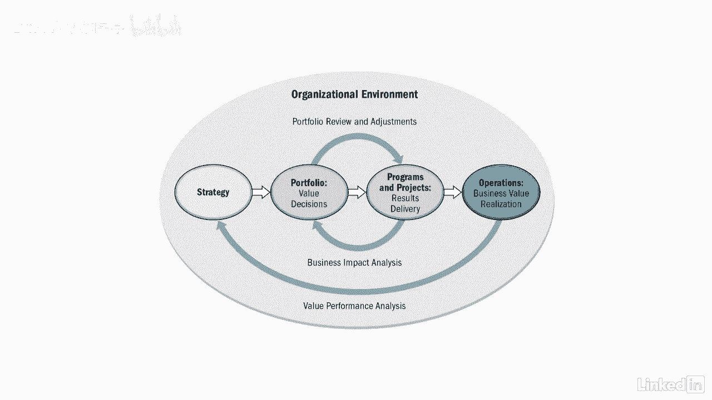

# 061-Lynda教程：项目管理专业人员(PMP)备考指南Cert Prep Project Management Professional (PMP) - P6：chapter_006 - Lynda教程和字幕 - BV1ng411H77g

现在你可能在想，好啦，现在我知道什么是项目管理了，什么是项目计划和投资组合，这三者有什么区别呢？让我们来看看每一个，看看它们是如何开始的，一个项目是独一无二的，就像以前从来没有做过一样，它是暂时的。

有开始和结束的日期，它可以是一个独立的项目，也可以驻留在程序或投资组合中，例如，一个项目可能正在建造一个巨大的购物中心，与商场每个阶段的所有子项目，一个独立的项目可能是在拐角处建一个加油站。

现在一个程序是当你一起管理一组项目或子程序时，为了获得一些利益，你通常不会通过单独管理它们来获得，例如，管理整个项目的风险并理解项目的相互依赖关系，一个程序的例子是一艘新的游轮，与设计和建造船舶的项目。

发射和集成船上所需的所有系统，管理相互依赖关系，建造游轮的限制和任何问题都被称为项目管理，假设你正在做一个整合两家合并后的公司的计划，将有几个项目共同努力来完成这项工作，如果在其中一个项目中做出决定。

它的影响可能会被其他人感受到，通过管理整个计划，你将能够看到对其他项目的影响，风险，费用，以此类推，从而使程序得到更有效的管理，接下来是一个投资组合，其中包括项目，方案，次级投资组合。

以及为实现战略目标而管理的操作，投资组合应直接与组织的战略目标保持一致，项目组合管理是对一个或多个项目组合的集中管理，以实现战略目标，它专注于做正确的项目和项目。

投资组合管理的主要目标是指导各组织作出合理的投资决策，它还确保计划和项目与业务目标保持一致，同时适当分配资源，以实现预期的投资回报，一定要看看讲义，了解三者的区别。

所以你可能想知道所有这些碎片是如何组合在一起的，此图显示了项目如何，程序和子投资组合集成到整个投资组合中，让我们仔细看看每一个关卡，从底部开始，共享资源和利益相关者，下一行是您的项目和操作。

注意共享资源和涉众是如何在操作中与项目来回移动的，那是因为所有的项目都需要两者，从底部开始的第三行和第四行有程序和投资组合箭头，从项目进入项目和投资组合，那是因为有些项目是计划的一部分。

而其他的是投资组合的一部分，最下面的四行都是整个投资组合的一部分，称为样本组合，在本例中，另一种说法是，高级投资组合由所有项目组成，方案，低于它的子投资组合和操作，您可能会注意到这个图中包含了操作。

操作对任何项目都很重要，因为它是维持组织运行的日常活动，在产品生命周期中，运营和项目管理有时会交叉，当一个项目的运营或业务发生变化时，这些交叉是很重要的，一旦项目完成，交付品被转移到操作部门。

在那里他们将负责管理它，例如，如果一个项目正在开发一个组织将使用的新数据库，一旦项目结束，它的人需要维护数据库，如果没有利益相关者和我们的资源，你就不会有一个项目需要管理，另外。

在整个投资组合中需要一些相同的资源和涉众，这可能会产生冲突，需要通过协调来解决，把所有这些都考虑进去就是所谓的组织项目管理，或者OPM，这张图显示了策略之间的相互关系，投资组合方案。

项目和运营都是项目成功的关键。

现在你知道了一个项目和，方案和投资组合，你知道什么是项目管理看看你想看到什么，如果他们是。