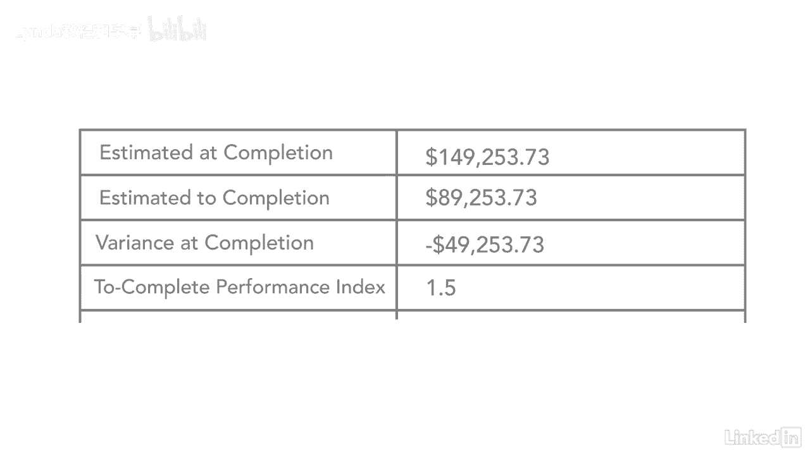

# 061-Lynda教程：项目管理专业人员(PMP)备考指南Cert Prep Project Management Professional (PMP) - P61：chapter_061 - Lynda教程和字幕 - BV1ng411H77g

好啦，所以我们已经完成了前四个变量，我们还做了接下来的四个公式，所以让我们来看看最后四个，好啦，所以你会注意到我们有，即完成时的估计，这是说，如果你继续你现在的方式，你估计完工时多少钱？

这个项目结束时我预计能花多少钱？等预计完成，上面是这么说的，好啦，我现在已经花了这么多钱，我还要花多少钱才能完成这个项目，然后VAC是完成时的方差，上面写着我总共需要花多少钱，才能走到项目的最后。

我需要花多少钱，除了我已经花的钱，那么这两者有什么区别呢？好啦，那么方差是多少，最后一个是tcpi，哪两个完整的性能指标，它的作用是如果你继续你现在的方式，其他一切都没有改变。

我需要在这个项目上投入多少精力，为了按时完成，所以让我们来看看这些，记住我说过一旦你有了这四个变量，你所要做的就是把它们插入公式中，所以让我们继续做吧，所以我们有BAC，也就是十万美元。

你把它除以你的cpi，我们说这里的cpi是0。所以我要做的是看看，嗯，零点六七，我们用更高的数字，当你把这十万美元除以零点六七，你最后得到了十四万九千，二百五十三，七十三，好啦，所以这是说。

当我完成这个项目时，现在要花我十四万九千，二百五十三元七十三分，所以你可能会看着它说，嗯哼，我们开始了这个项目，完成的预算是十万美元，你告诉我现在的估计是十四万九千，比我预计的多了将近五万九千美元。

所以就在那里竖起了红旗，作为一个赞助商，你真的应该注意这一点，好啦，那么让我们来看看估计到完成，所以你带着每个人，就在这里，一百四十九，二五，三点，七，三个，你在减去你的实际成本，六万。

所以这个数字最终是八万九千，所以说是对完工的估计，所以我已经在这个项目上花了6万美元，为了让我完成这个项目，我可以再付八万九千美元，二百五十三，所以它实际上比，好啦，方差就是看一下，好啦，你在拿你的背。

你在减去你的背，所以我们的贷款是十万，减去你的EAC，是一四九，所以你已经知道了，看着这个，这是一个负数，这是不好的，好啦，七三，好啦，所以这是你完成时的方差，你想在这里付十万，这就是你所说的。

完成时的估计数，你还要多付四万九千美元，好啦，差别太大了，所以看这三个数字，就像我在这里告诉你的，你应该把项目经理拉到一边和你的项目经理谈谈，现在你有了这些美元价值，你的项目要多花百分之五十的钱。

我肯定会把项目经理拉到一边，弄清楚发生了什么，因为你的银行账户，你在这里花了很多钱，好啦，再到完成性能指标，这只是说，好啦，如果一切都没有改变，完成这个项目我需要付出多大的努力？

所以让我们继续把这些数字插进去，所以我们有十万美元，减去我们的挣得价值，对四万，减去实际费用6万，还记得我之前说过这四个，我说，为了让你知道，好啦，如果这是好是坏，如果它等于，或者不止一个好的。

如果少于一个，这与tcpi公式是不好的，这是规则的例外，所以用这个，如果是的话，或小于或等于1，这很糟糕，如果少于一个，这很好，因为这是向你展示你需要做的努力，为了让你的日程回到计划中，好吧，你的费用。

所以在这个特殊的情况下，你得工作一分，为了让你的项目回到你的计划中，要努力五倍，所以这是多工作50%，再硬五成，所以你的团队实际上要付出更多的努力，或者你可能要雇更多的人什么的，但这就是努力的程度。

为了你要扩展，为了让你的项目回到计划中，所以这个项目，你看得出来，做得不是很好，数字看起来一点都不好，当你看到这里的总成本时，这个赞助商应该很不高兴，因为他把所有的钱都花在了，你知道的。

比项目开始时的预期多50%，所以现在还早，最好在项目的早期就找出这些数字。

所以你可以看看这些，看看你能做些什么来调整你的时间表和成本，把它带回计划，所以你有了，我们经历了一个例子--赚取价值问题，在这种情况下，这不是一个很好的项目，他们做得很糟糕。

但希望这能帮助你理解如何赚取价值公式。