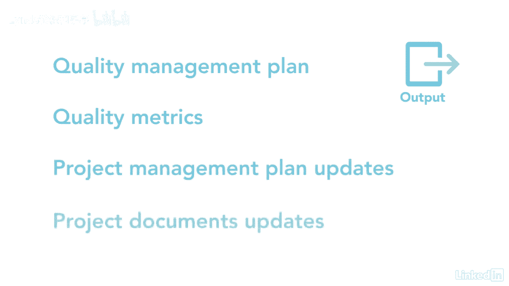

# 061-Lynda教程：项目管理专业人员(PMP)备考指南Cert Prep Project Management Professional (PMP) - P63：chapter_063 - Lynda教程和字幕 - BV1ng411H77g

在我职业生涯的早期，在我的项目中，我甚至没有想到质量管理，我假设如果我正确地管理了一个项目，质量会在那里，这并不是说简单的质量管理最终是项目经理的责任。

它需要在每个步骤计划中构建到项目过程和可交付成果中，质量管理属于计划过程组，它确定了项目的质量标准和要求，它还包括该项目将如何遵守这些标准，让我们仔细看看这个过程的ittos，有不少。

所以我会涵盖那些你可能在考试中看到的，可能影响质量管理的需求和目标，其次是风险管理，利益攸关方参与和需求管理计划，每一个都提供了关于如何识别，分析和管理利益相关者确定的需求，然后是范围基线。

其中包括描述每个交付品的验收标准的范围声明，验收标准可能会增加项目的质量成本，利益攸关方登记册很重要，因为每个利益相关者可能有特定的质量需求需要考虑，风险登记册是一种输入。

其中包含关于已确定的每个项目风险的信息，可能影响质量的威胁和机会，还要记得查看项目章程，假设，日志要求，文件要求，溯源矩阵，还有E和OPAS，现在让我们来看看这个过程的七种工具和技术。

关于每一个的细节可以在计划质量管理讲义中找到，一定要去看看，你可能会在考试中看到问题，从讲义开始，数据收集技术可包括集思广益和基准测试，它正在比较类似的项目以确定最佳实践，经验教训和业绩计量。

最后是与利益相关者的面谈，以了解他们对质量的想法，数据分析对收集到的数据进行成本效益分析，这着眼于实施质量过程是否具有成本效益，如预防，评估和失效成本，成本等式被用来计算为保证质量而产生的成本。

现在数据已经分析过了，它需要使用几种数据表示技术来显示，比如流程图、逻辑数据模型、矩阵图和思维导图，技术上的另一个工具是测试和检查计划，这是为项目期间何时进行测试和检查制定计划，最后的工具和技术是决策。

专家判断和会议，第一个输出是质量管理计划，这为如何管理质量管理过程提供了指导，下一个是质量指标，它是对项目或产品属性的描述，以及如何测量，例如，缺陷或完成的任务数，最后的产出是项目管理计划和项目文件。

更新，规划质量是项目和产品的一个主要过程，因为仅仅创造一个产品或过程是不够好的，它必须内置，以确保创造出最佳质量的产品，流程也尽可能平稳运行。

