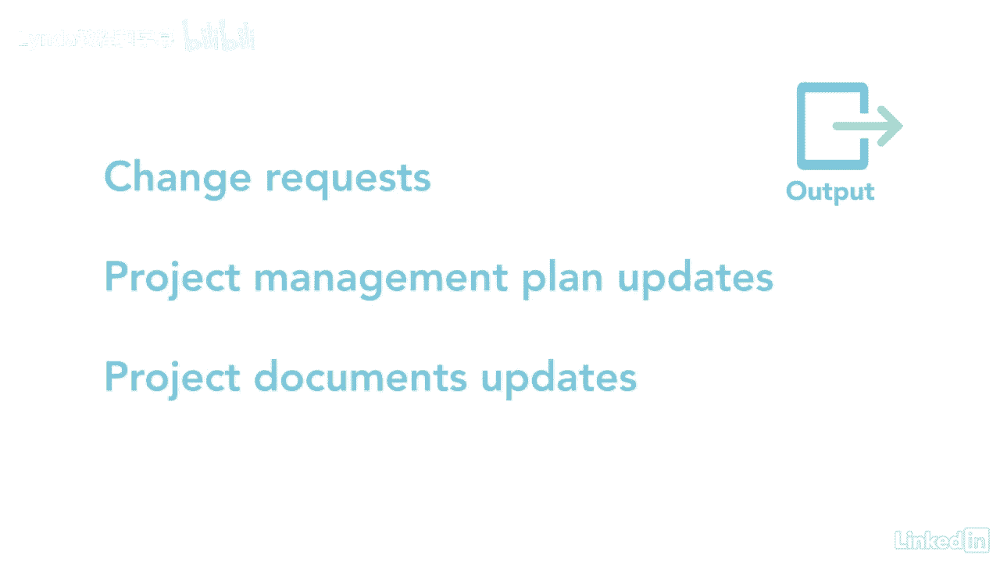

# 061-Lynda教程：项目管理专业人员(PMP)备考指南Cert Prep Project Management Professional (PMP) - P64：chapter_064 - Lynda教程和字幕 - BV1ng411H77g

执行质量保证过程可能有点混乱，在质量管理知识领域有两个过程，又称质量保证和质量控制，管理质量就是确保过程得到遵循和控制质量，确保产品符合质量规格，管理质量和控制质量通常与此过程并行进行。

我们专注于质量保证活动，但它也包括产品设计方面和工艺改进，队里的每个人，客户和管理层负责质量管理，管理的质量过程属于执行过程组，并采取质量管理计划中所描述的。

并将其转化为可在项目执行期间审计的可操作活动，这方面的例子可能是创建构建产品时需要遵循的工作说明，然后将对团队成员进行审计，看看他们是否遵循了流程，这样做是为了确保质量从现在开始就融入产品或服务。

让我们仔细看看这个过程的ittos，我会涵盖那些你可能在考试中看到的，此过程的一些输入是计划质量管理过程的输出，比如质量管理计划，它解释了如何管理这个过程，下一个是质量指标。

它们提供了项目或产品属性的描述，以及如何测量它的整体高度和宽度，质量控制测量来自控制质量过程，用于评估过程，以及是否达到了质量要求，最后的输入是教训，学习寄存器，风险报告，和奥帕。

第一个工具和技术是数据收集或核对表，并提供要执行的步骤列表，接下来是数据分析，其中包括替代品，文件处理和根本原因分析，技术上的下一个工具是数据表示，这个过程的清单很长，因此。

请阅读管理质量工具和技术讲义以获得更多详细信息，数据表示包括以下图表，亲和力，因果，在鱼骨也叫石川，还进行审计，以了解项目小组是否遵循组织和项目政策，任何发现都立即得到处理和修复。

记住内部或外部审计员可以做这些审计，接下来是X的设计，也称为实验设计，它是一套在产品设计过程中使用的技术指南，用于优化特定方面，如安全，例如，你可能看过碰撞测试，电视上用来显示安全功能和汽车的假人。

汽车制造商将开发一种汽车，然后通过一系列实验来运行它，把车撞到墙上，例如，看看汽车有多安全，他们根据结果做出改变，并继续实验，直到他们达到他们想要的安全标准，另一个是解决问题--这需要定义问题是什么。

确定解决方案，实施最佳解决方案并检查其是否有效，也有使用计划的质量改进方法，做检查行动和六西格玛改进计划中的过程做检查行动，你制定一个改变的计划，然后执行计划并检查结果，最后，您现在进行更改以改进过程。

让我们继续讨论输出，首先是质量报告，这些可以是图形化的，数字或质量，并被其他人用来采取纠正措施和改进质量过程，接下来是测试和评估文件，然后用作控制质量过程的输入，查看项目是否达到了质量目标。

这些文档的例子可能是检查表和需求可追溯性矩阵，其余产出为变更请求，项目管理计划更新和项目文件更新。

管理质量可能有点挑战性，但是如果团队中的每个人都遵循流程并继续改进。