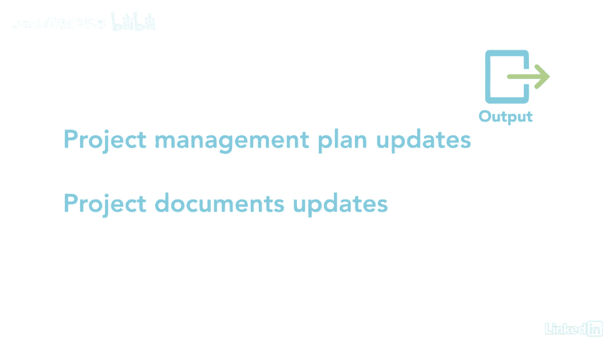

# 061-Lynda教程：项目管理专业人员(PMP)备考指南Cert Prep Project Management Professional (PMP) - P65：chapter_065 - Lynda教程和字幕 - BV1ng411H77g

在控制质量过程中，关键在于确保产品符合质量标准，在管理质量方面，一切都是为了审计过程，现在我们将讨论产品--两个截然不同但又联系在一起的过程，此过程在项目的整个生命周期中进行，只要有需要检查的输出。

这是一个过程，你将遵循控制质量在监视器下，控制过程组，它监控和记录执行质量活动的结果，检查性能并确保产品输出完整，正确并满足客户期望，以下是这个过程的ittos，这个过程有七个输入。

所以让我们从第一个主要的开始，质量管理计划，其中详细说明了如何管理此过程，下一个是质量指标，它提供了项目或产品属性的描述以及如何度量它，另一个输入是测试和评估文档，这些用于确定是否达到了质量目标。

其次是工作绩效数据，是关于产品状态的原始数据，像观察和技术性能，批准的变更请求是另一项输入，请记住，只有经过批准的更改才会被执行，这些更改可能包括缺陷，修理，更新工作方法，甚至可能改变时间表。

下一个输入是可交付的，这些是你检查质量的东西，它可以是任何唯一的和可验证的产品，执行完成过程所需产生的服务的结果或能力，阶段或项目，其他的投入是教训，学习寄存器，Eevs，和歌剧。

让我们来看看工具和技术，第一个是数据收集，其中包括核对表，它们提供了要执行的步骤列表，和这里看到的检查表列出了您想要收集的数据，例如，缺陷，每次看到一个不同的缺陷，在检查表上输入理货，其次是统计抽样。

从感兴趣的人群中选择一部分进行检查，例如，你要从一盒两块巧克力中随机挑选五块，还有问卷和调查，用来获得客户满意度的数据，在他们接受产品或服务后，一旦收集到数据，数据分析的时候到了。

它查看性能审查和根本原因分析，以将结果与质量指标进行比较，并识别缺陷来源，检验用于检验产品，看是否符合标准，接下来是对产品或服务执行的测试和产品评估，看看是否有不合格之处，从管理质量过程来看。

下一步的一些技术可能看起来很熟悉，数据表示技术包括因果图，直方图，控制图和散点图，查看控制质量工具和技术，有关这些工具的详细信息的讲义，终于，让我们看看这个过程的输出，主要有四个，首先是质量控制测量。

这些是控制质量活动的记录结果，下一个是经过验证的交付品，确保产品或服务构建正确，工作绩效信息查看是否满足要求，如果有任何不合格品或需要返工，这两个操作的纠正操作可能需要更改请求。

其余产出是更新项目管理计划和更新项目文件。

在这个过程中有很多关键的东西，因为最终目标是要有经过验证的可交付成果，然后可以被验证和接受，记住，需要仔细注意才能理解这个过程。

