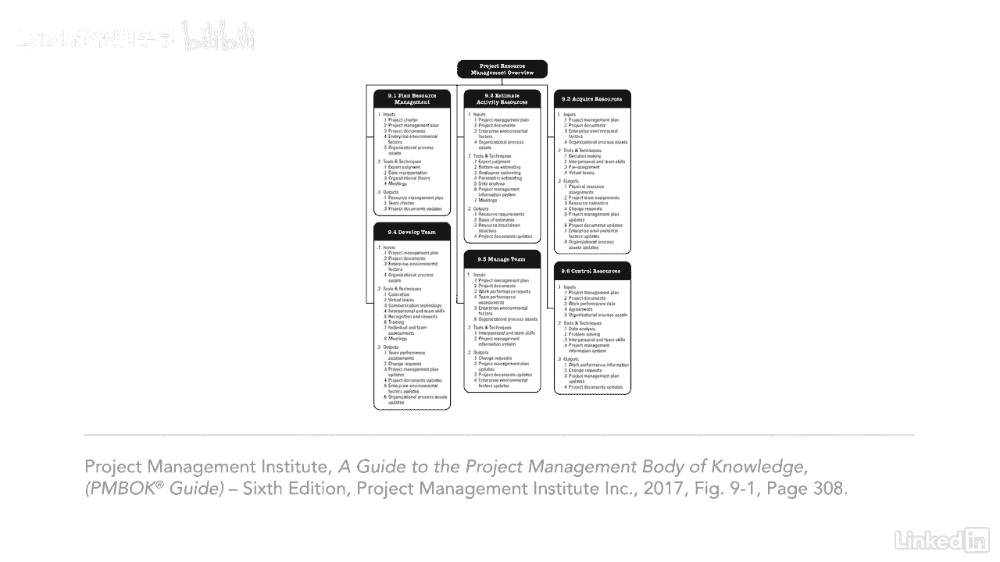

# 061-Lynda教程：项目管理专业人员(PMP)备考指南Cert Prep Project Management Professional (PMP) - P66：chapter_066 - Lynda教程和字幕 - BV1ng411H77g

项目经理通常认为资源只是人力资源，但它也包括物理资源，如设备，用品，设施，还有更多，资源管理知识区域涵盖了如何确定项目所需的内容，以及如何获取和管理它们，这个知识区域很重要。

因为您需要团队成员来帮助项目工作，他们需要物质资源来完成这项工作，但事情并没有就此结束，一旦资源被分配给团队，由项目经理来监督这项工作，还要带队，项目经理如何组成一个有凝聚力的团队，将决定项目的成败。

对球队有一些影响，项目经理应该知道，首先是团队环境，小组成员的地理位置，以及如何处理通信，还有内部和外部的政治需要应对，文化问题和组织独特性，就像每个人都在立方体里工作一样，即使是首席执行官。

在发展团队时，需要考虑所有这些影响，因为每一个都可能产生影响，例如，如果团队成员在同一地点，他们的结合水平将不同于一个成员分布在世界各地的团队，对项目团队的另一个影响是项目经理如何与团队联系和互动。

情商在项目管理中越来越普遍，现在你可能会问自己什么是情商，好吧，简单地说，它变得越来越有自我意识，意思是认识自己，以及你对他人的行为或反应，它是管理你与他人的关系，就像项目团队一样，研究表明。

练习情商的团队表现更好，效率更高，还有一种趋势是允许团队自我组织，意思是团队成员计划工作和工作，计划，项目经理扮演更多的是支持角色，并信任团队在人力资源的另一面完成工作，是对物质资源的管理。

如果管理不当，这个项目可能会关闭，如果物资不能按时到达或没有订购足够的设备，需要在知道何时订购材料之间取得平衡，用品和设备，以及这个知识领域有多少知识，过程是如何相互流动的，作为输入有意义的是什么。

工具，输出会在考试中很好地为你服务，大家可以看到，有很多变数需要考虑，当涉及到为您的项目获取和管理资源时，与任何项目一样，确保您根据项目需要定制实践。

