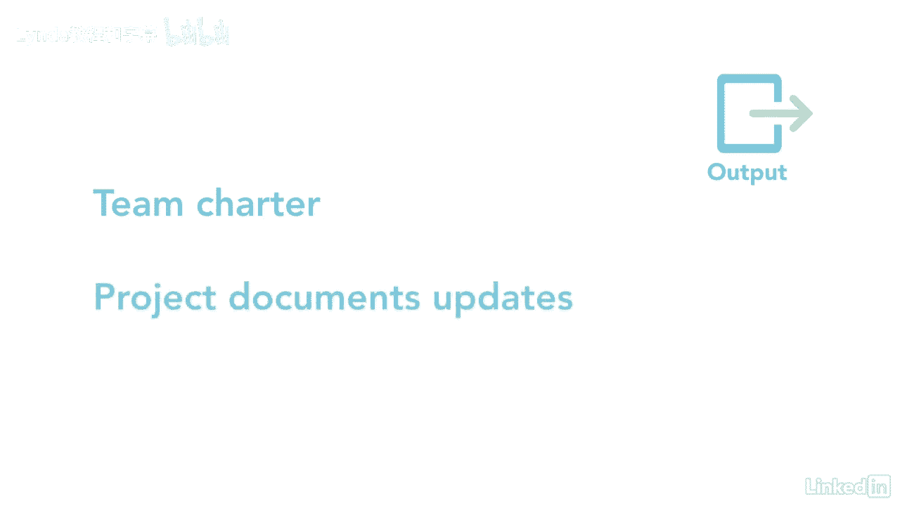

# 061-Lynda教程：项目管理专业人员(PMP)备考指南Cert Prep Project Management Professional (PMP) - P67：chapter_067 - Lynda教程和字幕 - BV1ng411H77g

计划资源管理过程的主要收获之一是，它不仅有助于确定项目所需的人力资源，也包括物质资源，它确保实际的人力资源拥有项目成功的正确技能，计划资源管理属于计划过程组，并告诉您如何估计，获取，发展。

管理和控制您收到的资源，以下是这个过程的ittos，让我们来看看你可能在考试中看到的，主要输入是范围基线，它列出了需要资源的活动，不同的类型，如高级程序员或机器操作员，另一个关键投入是项目章程。

它提供可用于项目的预先批准的财政资源，这可能会影响项目所需的资源，另一个关键投入是质量管理计划，它详细说明了维护项目定义的质量级别集所需的资源，接下来是项目时间表和需求文档。

这些显示了项目所需的不同类型的资源，当他们需要的时候，还应审查风险和利益攸关方登记册，因为它们可能影响资源，其他输入是fs和opas，这个过程的第一个主要工具和技术是数据表示或分层图表。

通常是以自上而下的格式完成的，示例可能包括以下工作分解结构，就像这里显示的那个，每个工作包都有更多的细节，还有一个资源分解结构或rbs，就像这个显示项目所需资源的，在这种情况下，是内部和外部资源。

另一个是组织分解结构，显示了部门的划分，单位或小组，是赋值矩阵，也称为责任分配矩阵或R M，你可以在这里看到，它被表示为一个网格，使用分配给工作包的每个资源，另一个流行的矩阵是活泼。

其中详细说明了谁应该对此负责，负责任，咨询，并为每一项活动提供信息，最后一种是面向文本的格式，对于提供特定活动的更多细节很有用，然后在一个活泼的或公羊中详细描述了什么。

这些也被称为职位描述或角色责任授权表，组织理论是另一个工具，它提供了关于团队成员和组织如何行为的信息，最后的工具和技术是专家，判决和会议，这一进程的主要产出之一是资源管理计划，其中包括确定资源。

他们的作用和责任，以及如何获得它们，每个角色都有细节，权力级别，每个团队成员的责任，以及每项活动的能力水平，其他是项目组织结构图和项目团队资源管理，显示了资源，并提供了如何定义，工作人员。

管理和释放团队资源，然后是训练，团队发展，以及表彰计划，每个团队成员都必须具备完成他们在团队中角色的技能，记住，应在整个项目生命周期中计划表彰和奖励，另一个关键产出是团队章程，它记录了团队的价值。

小组的协议和操作指南，最后一个输出是项目文档更新。

大家可以看到，规划和资源管理涉及很多，这不仅仅是为项目获取资源，而是关于你如何获得它们，当你得到他们的人力资源，它理解团队成员的角色和责任，他们是否受过训练，以及他们是如何得到奖励的。

