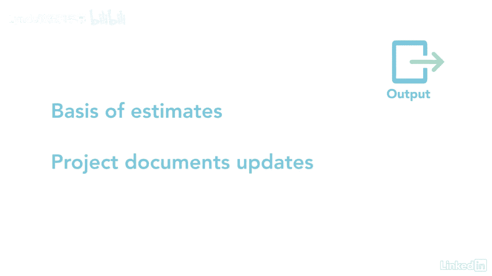

# 061-Lynda教程：项目管理专业人员(PMP)备考指南Cert Prep Project Management Professional (PMP) - P68：chapter_068 - Lynda教程和字幕 - BV1ng411H77g

你曾经开始过一个项目吗，却在第一天就嘎然而止，因为关键资源不可用，或者更糟，它从来没有被考虑过，你不想遇到问题吧，因为缺乏特定活动的资源，这可能会关闭您的项目，资源可以是人力资源中的任何东西。

材料和设备，因此，让我们看看估计活动资源过程需要什么，所以这不会发生在你身上，它属于规划过程组，它正在估计团队的人力资源需求，加上任何设备，执行每项活动所需的用品或材料。

让我分享一下你可能在考试中看到的内容，此过程的第一个输入从资源管理计划开始，它描述了如何确定资源以及需要多少资源，下一个是范围基线，它有一个项目的范围，推动了对资源的需求。

接下来的两个输入是活动列表和活动属性，这些很重要，因为它们列出了项目需要资源的活动，下一个是费用估计数，项目成本可能会影响您可以获得的供应品数量，或特定资源的技能水平，例如，你可能需要一个高级程序员。

但你只能雇得起初级程序员，告诉你什么时候和多长时间可以为项目提供资源，它们还确定工作日和非工作日，风险登记册是另一项关键投入，因为风险可能决定项目所需的资源，例如，如果因为下雨而有洪水泛滥的风险。

然后你可能需要雇一个洪水专家，Eevs作品和假设日志是最后的输入，第一个关键工具和技术是替代分析，这着眼于各种其他方式，你可以完成项目中所需要的，下一个工具用于估计，包括自下而上，类比和参数技术。

最后的工具是专家判断会议，这个过程有三个主要输出，首先是所需资源，确定每项活动所需资源的类型和数量，在工作包中，一旦为每项活动确定了资源，然后将它们相加为人力资源总数，机械，项目所需用品和设备。

第二个主要输出是资源分解结构或rbs，这里有一个苏格兰皇家银行可能是什么样子的例子，这类似于WBS，但它显示了按类型和类别划分的资源，三是估算依据，它提供有关资源选择的支持信息。

最后一个输出是项目文档更新。

没有什么比发现你需要的资源不可用更糟糕的了，发生在我身上，在那之后的每一个项目中，我都确保专注于这个过程，这样就不会再发生了。

