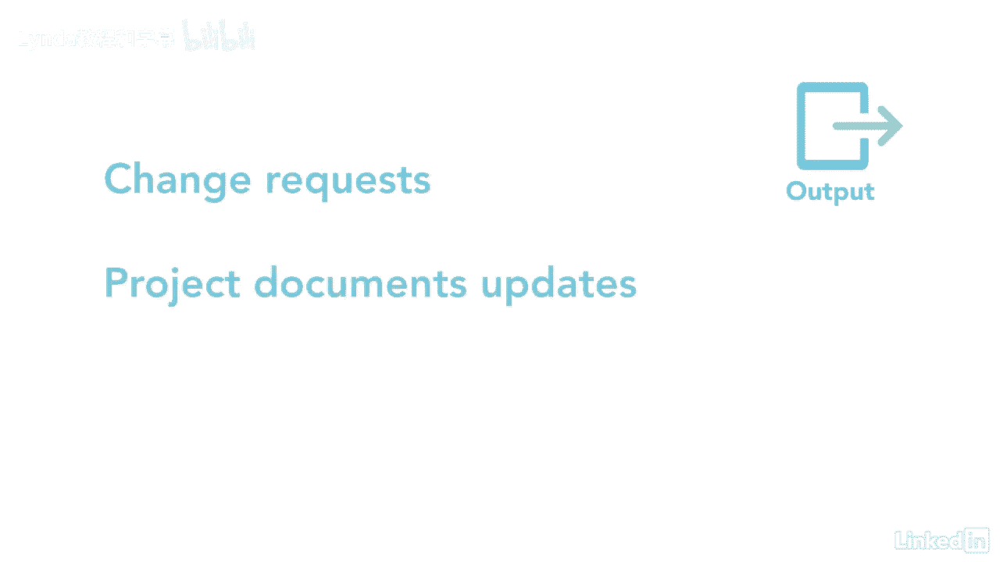

# 061-Lynda教程：项目管理专业人员(PMP)备考指南Cert Prep Project Management Professional (PMP) - P69：chapter_069 - Lynda教程和字幕 - BV1ng411H77g

获取资源过程侧重于为项目获取适当的资源，我说适当，因为在正确的时间拥有正确的资源是很重要的，获取资源属于执行流程组，当你获得你的团队和物质资源，像材料，完成人力资源项目活动所需的用品和设备。

您的团队应该具备执行分配给他们的活动所需的技能，并在需要时可用，主要的好处是为具体活动选择和分配资源，在这个过程中有几个因素需要考虑，第一批，为了获得合适的团队成员，项目经理或管理团队。

需要利用他们的影响力和谈判技巧来对付那些有资源的人，得不到这些资源可能会对项目时间表产生负面影响，预算或质量，导致可能的项目失败，如果没有所需的人力资源，然后，团队可能必须获得一个具有不同能力的人。

而不是所需要的，这可能会影响项目时间表或预算，因为你可能需要雇佣更多的人来弥补技能的不足，既然你已经把这些因素考虑进去了，让我们来看看这个过程需要什么，让我看一下你可能在考试中看到的内容。

这一过程的主要投入是资源管理计划，它提供了如何获得资源的细节，是采购管理计划，其中详细说明了如何获得外部资源，成本基线是下一个，因为它提供了项目的总体预算，可能会影响资源，其他投入包括利益攸关方登记册。

项目时间表，资源日历和所需资源，它们在需要时提供了实际资源需求的详细信息，当他们有空的时候，剩下的输入是fs和opas，现在让我们来看看工具和技术，首先是预分配，这是在项目开始之前命名团队成员的时候。

当您需要特定的技能集，而某些资源具有这些技能时，可能会发生这种情况，预分配可以在项目章程的早期进行，尤其是如果项目依赖于他们，其次是人际交往和团队合作能力，特别是谈判能力，就像听起来一样。

为了获得项目所需的资源，您可能需要与职能经理协商，其他项目团队甚至外部组织，供应商或承包商，这个项目的成功取决于这些谈判进行得有多顺利，虚拟团队是为团队获取可能不可用的资源的另一种方式。

假设你需要有人来编辑文档，但是在您的位置没有可用的资源，但是在另一个国家有一个，你可以把这个人加入团队，完成这个角色，随着科技的进步，这变得容易多了，这个过程的最后一个工具是决策，多准则决策分析。

制定并用于选择资源的最低要求清单，标准根据团队需求的相对重要性进行加权，例子可能是可用性，成本经验，能力和技能，这个过程有输出，主要是物理资源、项目团队分配和资源日历，你会离开这个过程。

了解分配到项目的每个团队成员的姓名，日历将反映他们何时开始和停止项目工作，你也会知道什么时候物理资源可用，其余输出为eef和opa更新，更改请求，项目文件和项目管理计划更新。

这个过程相当容易记住，但当涉及到为项目团队配备人员和获得物理资源时，这是至关重要的，当你在正确的时间拥有所有正确的资源时，这是很好的，然后你就可以坐以待毙了。

