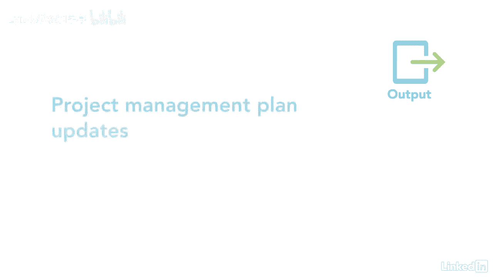

# 061-Lynda教程：项目管理专业人员(PMP)备考指南Cert Prep Project Management Professional (PMP) - P72：chapter_072 - Lynda教程和字幕 - BV1ng411H77g

你曾经做过一个不得不推迟工作的项目吗，因为没有资源，你开得很好，然后砰的一声，您被停止是因为某个零件或设备不可用，如你所知，这会对项目产生严重的负面影响，控制资源过程属于监视和控制过程组。

并确保物理资源在正确的时间用于您的项目，在正确的地方，用合适的量，它还包括计划与实际使用情况，所以你可以计划更多或释放资源，这是通过查看迄今为止使用的资源来确定是否需要任何额外的资源来实现的。

或者如果工作完成了，释放这些资源，以下是这个过程的ittos，让我们先讨论一下你可能在考试中看到的，有一个资源管理计划告诉你如何使用，控制和释放项目上的物理资源，接下来是物理资源分配，项目时间表。

资源细目，结构和所需资源，所有这些都确定了每项活动所需的资源，当你需要他们多久，和类型，另一个输入是问题日志，与资源有关的任何问题都将在此日志中，例如，接收不合标准的材料，下一个输入是工作绩效数据。

提供资源使用的更新，下一个输入是风险登记册，这确定了可能影响资源的风险，最后一个关键输入是协议--它们提供关于公司外部资源的信息，我想说的一点是，协议和合同是一样的，他们是同义词。

你可以在考试中看到任何一个词，最后的投入是吸取的经验教训，注册和OPA，第一个工具和技术是数据分析，其中可能包括替代品分析，本文研究了纠正资源使用差异的方法，例如，如果一项活动的时间比预期的要长。

则添加更多的资源，此外，还有成本效益分析，着眼于纠正措施的选择，业绩审查，看看资源的计划使用和实际使用，最后是趋势分析，此技术查看资源如何随着时间的推移而执行，看看是否需要修改或增加。

第二个工具和技术是解决问题，项目经理应采取措施解决资源问题，步骤是首先识别和定义问题，调查问题，分析一下，想出解决办法，最后检查溶液，其次是人际交往和团队合作能力，包括谈判和影响。

最后一个工具和技术是pmis，两项主要产出中的第一项是变更请求，任何时候你分析和资源使用，有改变的机会，二是工作绩效信息，它查看资源使用情况，看看是否有缺口，比如需要三辆卡车而不是两辆。

其他是项目管理计划和项目文件更新。

采取措施确保您的项目有适当的物理资源，将保证你的项目不会停止。