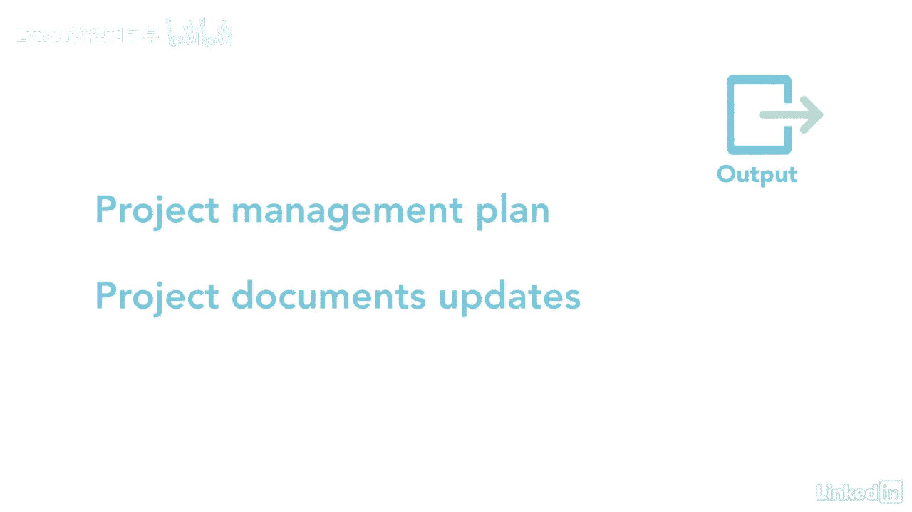

# 061-Lynda教程：项目管理专业人员(PMP)备考指南Cert Prep Project Management Professional (PMP) - P74：chapter_074 - Lynda教程和字幕 - BV1ng411H77g

沟通是项目经理最重要的技能之一，但这不仅仅是传递信息，关键是你怎么做，和谁多久，以及使沟通对项目如此重要和有益的沟通类型，项目经理90%的时间都花在沟通上，了解计划的不同方法是很重要的。

通信管理流程属于规划流程组，以及创建与利益相关者沟通的适当计划的过程，根据他们的需要和项目的需要，以下是这个过程的ittos，让我看看你可能在考试中看到的，五项投入中的第一项是项目章程。

它有一个您将与之交流的关键利益相关者的列表，其次是利益相关者登记册和利益相关者参与计划，登记册是所有利益相关者的名单，它告诉你管理它们的策略，还有资源管理计划，其中详细说明了如何分配团队资源。

管理和发布，需求文档还可能提供关于如何与涉众沟通的信息，其他输入是fs和opas，这个过程有许多工具和技术，首先是通信需求分析，它决定了利益相关者的沟通需求，下一个工具是通信技术。

用于在项目利害关系方之间传递信息的一套方法，例如会议，社交媒体，书面文件和网站，另一个工具是通信模型，它们表示发送者和接收者之间的通信过程，第四是沟通方式。

这显示了在项目利害关系方之间传递信息所使用的不同方法，例如，交互式方法是当利益相关者相互即时消息时，审查讲义计划，用于考试中可能出现的附加信息的通信管理工具和技术，另一个工具是人际交往和团队技能。

这可能包括政治和文化意识以及沟通方式评估数据表示，使用利益攸关方参与评估矩阵来跟踪利益攸关方参与方面的差距，从他们今天所处的位置，相对于你希望他们在哪里，剩下的工具和技术是会议和专家判断。

这一进程的一个主要产出是通信管理计划，这是项目管理计划的一个组成部分，它描述了，管理和监测将处理的通信程序，其他产出是项目管理计划和项目文件更新。

有效的沟通将帮助涉众更好地了解项目的执行情况，以及是否有需要解决的问题，有这么多交流的方法。