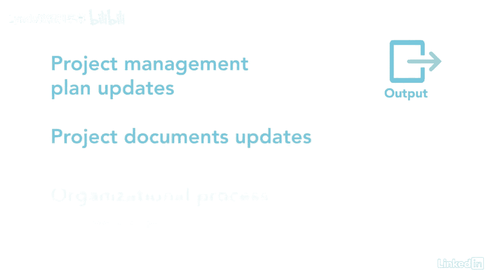

# 061-Lynda教程：项目管理专业人员(PMP)备考指南Cert Prep Project Management Professional (PMP) - P76：chapter_076 - Lynda教程和字幕 - BV1ng411H77g

我最初认为管理沟通与指导沟通有关，一旦我安排好他们，它实际上与收集项目的信息有关，创建通信，然后把他们送出去，让利益攸关方充分了解情况，帮助管理项目，管理通信流程属于执行流程组。

并确保收集有关项目的信息，然后创造了，分布式，存储，管理，监测，然后能够被取回，当涉及到通信时，有几种技术需要考虑，我会谈谈其中的几个，但是你应该查看弹球中的整个列表。

在工厂通信部分中是否讨论了发送方-接收方模型，有媒体的选择，其次是写作风格，最后是会议管理，让我们回顾一下这个过程的细节，你可能会在考试中看到，对这一进程的第一个投入是通信管理，资源管理。

利益攸关方参与计划，和利益相关者登记册，每一个都描述了利益相关者，所需的通信，它们是如何计划和组织的，以及利益相关者的适当参与，下一个输入是问题的变化，日志，风险登记和质量报告。

这些文档中的每一个都捕获了可能影响项目的信息，并需要传达给利益相关者，下一个是工作业绩报告，生成这些报告是为了帮助利益攸关方了解项目的状况，所以他们可以决定询问更多的信息，细节或澄清，并最终做出决定。

其他的投入是教训，学会了，登记册，FS和OPAS，这个过程有几种工具和技术，首先是通信技术，这可能会受到团队位置的影响，资料是否保密，以及会议在组织中是如何组织的，下一个工具叫做通信方法，并应足够灵活。

以满足利益相关者的需要，还有包括沟通在内的沟通技巧，能力，反馈，非语言交流，比如面部表情和演示文稿，另一个工具是项目报告，用于与涉众共享性能状态，这样他们就可以讨论项目并做出决定。

是人际交往和团队合作能力，专注于积极倾听和冲突管理，以及文化和政治意识，会议管理和网络，最后的工具是会议和采购经理人指数，这个过程有一个主要的输出，这就是项目通讯，这些可以与项目或时间表有关。

迄今发生的业绩费用和利益攸关方确定的其他信息，确保涉众接收并理解提供给他们的信息是很重要的，其余产出是项目管理计划，项目文件。

奥普拉的最新消息，让利益相关者了解项目绩效是项目成功的关键，一个假设是，如果利益相关者没有收到你的来信，那这个项目肯定有问题，通过管理项目沟通，确保这种情况不会发生在你身上。

