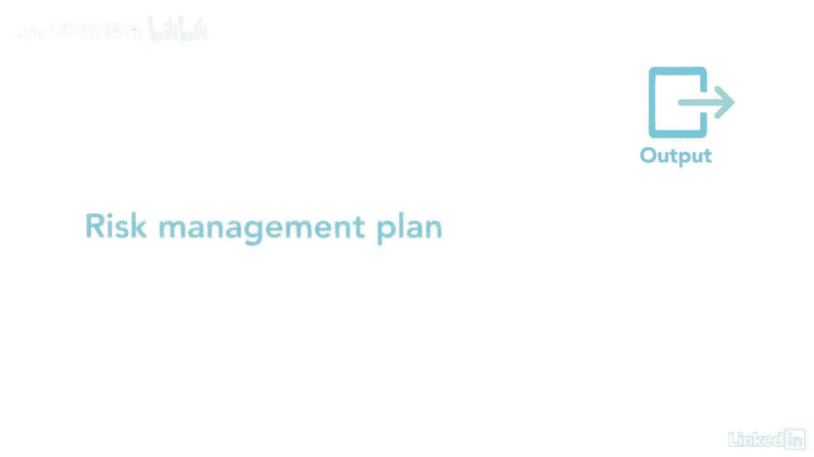

# 061-Lynda教程：项目管理专业人员(PMP)备考指南Cert Prep Project Management Professional (PMP) - P79：chapter_079 - Lynda教程和字幕 - BV1ng411H77g

计划风险管理是任何项目的关键过程，如您所知，每个项目本质上都有风险，有些是主要的，而其他的都是未成年人，不顾风险，每一个都需要管理，这个计划确定了项目团队将如何管理这些风险，风险管理流程属于规划流程组。

并概述了如何为项目执行风险管理活动，这个过程的主要好处是它描述了项目团队将如何识别，评价，军衔，并管理每一个风险，然后将这些风险传达给利益攸关方，积极主动地管理风险是项目经理的责任。

让我们来看看你可能在考试中看到的ittos，这个过程有五个输入，让我们从两个主要输入开始，一是项目章程，可能已在项目章程中确定了高度风险，检查它是否有任何其他可能导致项目风险的信息也很重要。

涉众登记册是另一个主要投入，因为它有与利益相关者交谈的每个利益相关者的名字，帮助为项目提供风险阈值，所以你知道谁厌恶风险，谁愿意冒险，下一个输入是项目管理计划，确保风险计划与项目管理计划一致。

最后的输入是fs和opas，这一过程的一个关键工具和技术是数据分析，更具体地说，利益相关者分析，这提供了风险管理所需的细节，喜欢他们在项目中的角色态度，他们在这个项目中的利害关系是什么，还有更多。

最后的工具和技术是专家判断和会议，这一过程的一个产出是风险管理计划，它是项目管理计划的一部分，它详细说明了如何管理该知识领域中的每个其他流程，风险管理计划可包括为风险提供资金，以及如何管理风险的方法。

风险管理团队也有角色和责任，加上风险类别，这可以通过风险分解结构或rbs来说明，以下是苏格兰皇家银行可能的样子，它显示了零级别的所有项目风险，然后第一级将它们分为技术或管理等类别，第二级是实际风险。

风险是有定义的，这里可以看到的概率和影响，您为您的团队设置这些参数并定义它们，所以他们知道如何对风险进行分类，然后可以在下一个工具中使用这些定义，是一个概率和影响矩阵，它显示了风险发生的可能性有多大。

对项目会有什么影响，如果有的话，最后一个输出是风险管理计划。

风险在所难免，因此，您的项目团队必须尽早识别它们，在整个项目中，没有什么比冒险更糟糕的了，本可以减轻或避免的。

