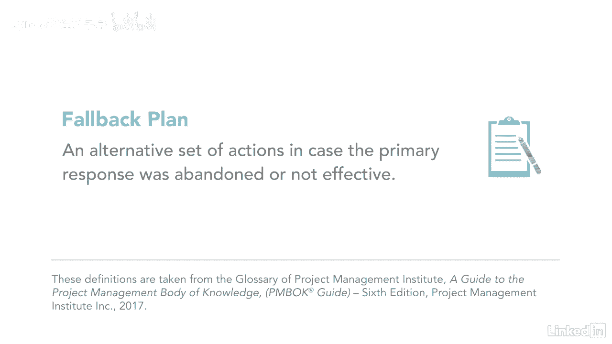

# 061-Lynda教程：项目管理专业人员(PMP)备考指南Cert Prep Project Management Professional (PMP) - P83：chapter_083 - Lynda教程和字幕 - BV1ng411H77g

最近我在教一门关于风险的课，我问我的学生他们是否经历过识别风险的过程，三个中只有三个说他们有，除了识别风险，他们都没有做任何事情，虽然很棒，他们开始了这个过程。

制定一个如何处理每一种风险的策略是很重要的，这就是这个过程的用武之地，计划，风险应对措施，流程属于规划流程组，是制定选择和行动的过程，降低或提高项目风险，关键的结果是有一个如何处理每一个风险的计划。

此外，将为每个风险分配资源和资金，任何行动都将被添加到项目的时间表中，这里，您可以看到此过程的ittos，让我们复习一下你在考试中可能看到的，第一个关键投入是风险管理计划，风险登记册和风险报告。

这些文件中的每一份都提供了关于正在考虑的风险的细节，二是资源管理计划，项目小组任务，提供关于分配给风险的资源及其可用性的信息的利益相关者登记册和资源日历，另一个关键投入是成本基线。

它有关于分配给风险的应急准备金的信息，例如额外的资金或时间表中的时间，其余的投入是经验教训，注册FS和OPAS，这个过程的工具和技术是考试的最爱，所以准备好一两个问题，让我们从应对威胁的策略开始。

一是规避风险，这是项目团队努力100%消除风险的时候，例如，买一台设备，以备不时之需，下一条是将风险责任转嫁给第三方，风险不会消失，只是被别人处理了，这方面的一个例子是通过保险或与某人签订合同。

三是降低风险，通过降低其发生的可能性或降低其潜在影响，例如，如果客人在婚礼上有淋湿的风险，那你现在就租一个帐篷，让我们来讨论机遇的策略，一是利用风险，这意味着尽你所能让风险百分之百地发生。

一个例子可以在最新的技术中使用，以更快地完成工作，所以你可以中标另一个项目，二是增强风险，通过影响导致风险发生的因素，例如，如果提前完成项目有积极效果，然后您可以添加资源来实现它。

另一个策略是与第三方分担风险，一个例子可能是，如果你正在推出一个新的产品线，您可以与第三方共享生产，以确保产品按时到达客户手中，让我们也讨论一下应对机遇和威胁的策略，首先是接受。

即项目团队接受可能发生的风险，如果它当时使用了一个临时解决方案，团队还可能增加意外准备金以应对风险，如果真的发生了，最后一种是将风险升级到计划或投资组合级别，当它超出项目范围或项目经理的权限时。

这些策略也可用于总体项目风险，到目前为止，我们一直在讨论个别风险，但集体审视项目的总体风险是很重要的，想出对策，下一个工具是应急反应策略，这些是在特定触发器发生时可能使用的响应，像暴雨一样。

会触发人们搭帐篷的反应，所以不要淋湿了，数据分析是另一种工具，用于确定应对措施的替代办法以及每种办法的成本和效益，下一个工具和技术，专家判断，便利化，访谈，和决策，用于从涉众那里收集信息。

以帮助就如何管理风险做出决策，产出是变更请求，更新项目管理计划和项目文件，还有其他几个关键术语你应该知道，因为你可能会在考试中看到关于他们的问题，一是残余风险，这是在实施风险应对措施后仍然存在的风险。

让我们用前面关于为婚礼租帐篷的例子，客人可能会被帐篷钉绊倒，这是一个残余的风险，次级风险是实施风险应对措施的直接结果，在与第三方分担生产风险的例子中，还有一个次要风险，即第三方达不到预期。

后备计划是一套可供选择的行动，以防主要响应在项目中被放弃或无效。

不仅要识别风险，但要制定一个应对每一个问题的策略。