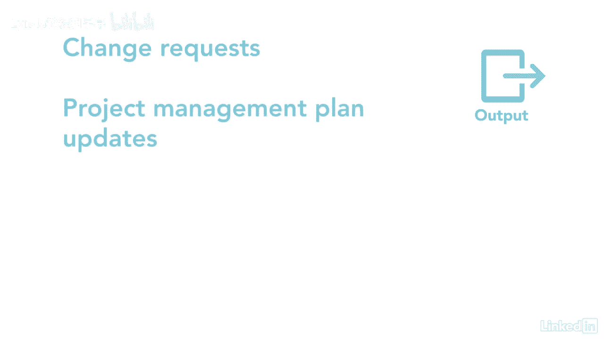

# 061-Lynda教程：项目管理专业人员(PMP)备考指南Cert Prep Project Management Professional (PMP) - P85：chapter_085 - Lynda教程和字幕 - BV1ng411H77g

在监测风险过程中，你在检查你计划做的事情是否实际发生了，该小组正在密切关注是否有任何风险触发因素，以及是否需要实施一个或多个响应，团队还发现了新的风险，所以它们可以被分析并添加到列表中。

项目经理跟踪现有风险的状态，看看它们是否过时，密切关注任何即将到来的，监控风险属于监控过程组，它执行响应计划，轨道，已查明的风险，发现新问题，并评估整个项目的风险过程有效性。

让我们来看看你可能在考试中看到的ittos，第一个关键投入是风险管理计划，风险登记册和风险报告，这些文件中的每一份都提供了关于正在考虑的风险的细节，其次是工作绩效数据和报告。

两者都提供了关于项目执行情况的数据，如果它们仍然开放，风险是否已经发生，以及那些发生的影响，最后的投入是经验教训登记册和问题日志，应审查两者，以确定是否有必要更新风险登记册。

这个过程中的第一个工具和技术是数据分析，包括技术性能分析，这是项目技术性能计划与实际的比较，一个例子，可能是跟踪装配线末端发现的缺陷数量，当您检查缺陷是否在定义的限制范围内时，储量分析。

看看是否还有足够的应急准备金来支付任何悬而未决的风险，第二个工具是审计，项目经理用来检查风险应对措施的有效性，以及风险管理过程，接下来是会议，团队在会议上公开讨论风险应该是常见的做法。

无论是对当前风险的更新还是讨论新的风险，一个关键的输出是工作绩效，提供关于风险应对规划和实施过程进展情况的详细信息的信息，其余产出为变更请求，项目管理计划。

项目文档和OPA更新，项目经理需要密切监测风险，因为决策需要基于当前的信息，这可以确保你不会被风险蒙在鼓里。

