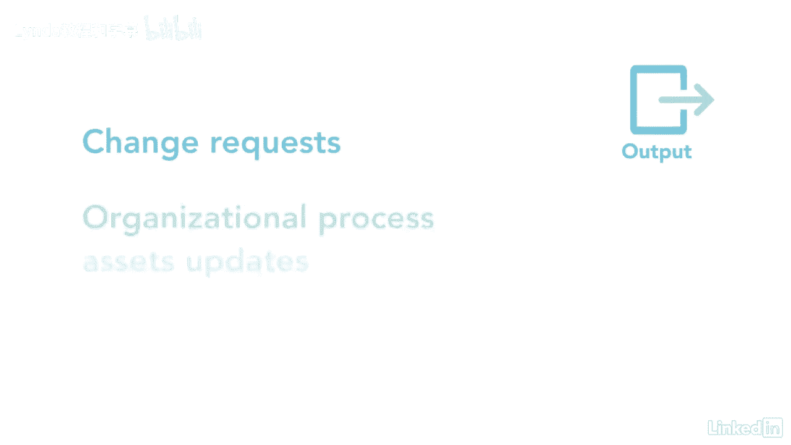

# 061-Lynda教程：项目管理专业人员(PMP)备考指南Cert Prep Project Management Professional (PMP) - P87：chapter_087 - Lynda教程和字幕 - BV1ng411H77g

计划的采购管理流程有助于确定产品是否，应该在组织之外购买服务或结果，在这个过程中，你经常面临着为你的项目做出还是购买的决定，如果你真的买了它的细节，什么，如何获得，何时获得，获得多少。

如果采购对你来说是新的，你可能想重复这个过程几次，直到它成为第二天性，考试中很有可能会有一个关于采购的问题，它属于规划过程组，它记录项目采购决策，通过指定方法和识别潜在卖家。

在这个过程中有很多术语和定义，查看计划中的采购管理术语和定义，有关更多信息的讲义，您可以看到此过程的ittos，我会涵盖你在考试中可能看到的那些，让我们首先看看这个过程的关键输入，从项目章程开始。

企划案和效益管理计划，这些文件告诉你有哪些财政资源可用，并需要与采购计划保持一致，接下来是范围，质量和资源管理计划，与范围基线一起，另一个是里程碑列表，上面有卖家和其他人见面的目标日期。

包括所需资源和项目小组任务，两者都确定所需的资源和技能集，是需求文档和需求可追溯性矩阵，需求文档描述了单个需求如何满足业务需求，矩阵将需求与可交付成果联系起来，风险登记册是另一项关键投入。

并列出项目的风险和可能需要采购的风险应对措施，其他输入是涉众登记册，FS与作品，其中可能包括预先批准的卖家名单，这个过程的工具和技术从数据分析开始，使用制造或购买分析。

此技术用于确定项目团队是否可以完成工作或可交付成果，或需要从外部获取，项目数据收集或市场研究是另一种工具，它是在会议上收集信息的过程，在线评论和其他来源，以确定市场能力，技术上的另一个工具是源选择分析。

它查看将用于选择卖方的标准，这有助于卖方更好地为投标过程做准备，剩下的工具和技术是专家判断和会议，第一个产出是采购管理计划，这详细说明了如何管理其余的采购过程，接下来是采购策略，其中包括项目交付方法。

协议类型和采购程序，这些可能是交付方法的组合，合同付款类型和采购阶段，下一个输出是采购工作说明书，这是对要做的工作的高级描述，工作说明书提供给卖方，应该有足够的细节，所以他们知道他们是否能做这项工作。

位文档是另一种输出，由给卖方的文档组成，这还包括一份工作说明，其中界定了合同中包括的工作，这些文件的通用名称是索取资料，建议或报价，另一个输出是源选择标准，这是用来评估卖方建议的，例子包括投标费用。

如果卖方技术健全，交货日期和管理经验，下一个输出是做出或购买决定，这些会告诉你具体的工作是在家里做还是由外面的人做，另一个工具是使用独立的费用估计数，这些对正在开始工作的组织来说是很好的。

他们以前从没做过，也不确定工作的成本或时间，这些估计数可用作比较新提出的建议的基准，其他产出是变更请求。

OPA和项目文档更新，请记住，在决定外包工作时，有几个变量需要考虑。