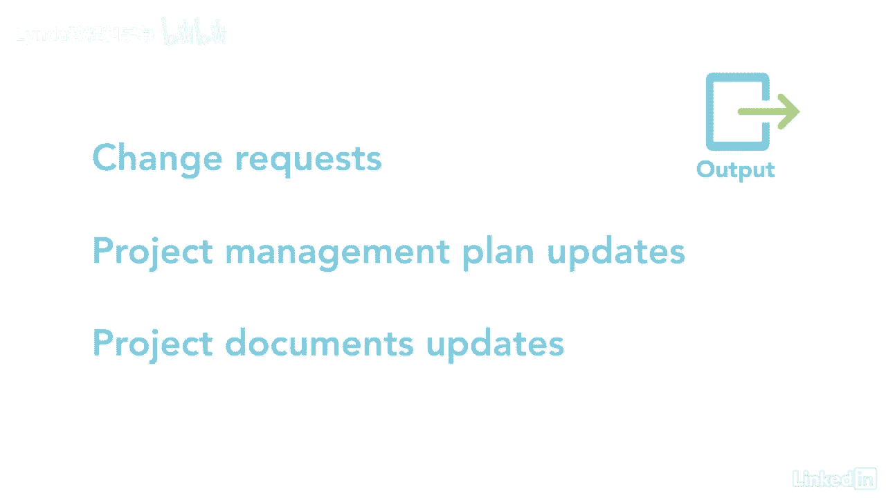

# 061-Lynda教程：项目管理专业人员(PMP)备考指南Cert Prep Project Management Professional (PMP) - P91：chapter_091 - Lynda教程和字幕 - BV1ng411H77g

连同项目章程，确定涉众是完成项目的下一个重要过程，识别那些受到消极或积极影响的人是项目成功的关键，确定涉众的需求并围绕它们构建需求也是关键，这是pmp考试的一个重要题目，因此。

您可以期待看到几个关于涉众的问题，好啦，让我们来看看识别利益相关者的细节，此进程在发起进程组之下，它是当你识别利益相关者并分析他们的时候，看看他们对你的项目有什么兴趣，另外你会发现他们参与了什么。

他们对你的项目的影响程度，此过程发生在项目开始时，并在整个项目生命周期中完成，您可以看到此过程的ittos，我会复习一下你在考试中可能看到的那些，这个过程的第一个输入是项目章程。

它可能有一个内部或外部利益相关者的名单，所以从那里开始很好，第二项投入是业务个案和效益管理计划，两份文件均可提供利益攸关方名单，其次是沟通和利益攸关方参与计划。

这些计划详细说明了如何与利益攸关方沟通和参与，其他投入包括问题和变更日志，两者都可以提供关于新利益攸关方的信息，或与当前利益相关者现有关系的变化，下一个关键输入是需求，文件和协议。

两者都将提供关于潜在利益攸关方的信息，其他输入是fs和opas，收集利益相关者信息的一种方法是使用数据收集技术，像问卷和调查，头脑风暴和脑力激荡，这些让个人在讨论问题之前先思考一下。

数据分析是利用利益相关者分析获取信息的另一种方式，这种方法收集和分析信息，确定在整个项目中应考虑谁的利益，来自这种方法的信息可以包括利益相关者对项目的兴趣，他们的作用，期望，权力级别，赌注。

他们有多大的影响力，一旦你有了这些信息，您可以通过使用涉众映射来表示数据，这些可以有几种形式，让我来解释一下其中的几个，一种形式的映射被称为权力和利益网格，您可以在本例中看到。

利益相关者A到H已经进入了四个象限中的每一个，根据收集到的信息，每个象限让项目经理知道谁需要被监视，保持满意，此示例使用权力和兴趣分类，但还有其他的，比如权力和影响，或者影响和影响。

项目经理可以选择其中一个或任何其他满足他们需要的组合，另一种类型的映射称为涉众多维数据集，它与电力和利息网格非常相似，但是它把利益相关者的信息放入一个三维模型中，第三种方法称为显著性模型，类似于网格。

但专注于权力，利益攸关方的紧迫性和合法性，如果他们属于三个类别中的一个或多个，然后在这里输入一个数字，第七涉众是你真正想关注的人，因为它们都属于这三类，八号完全超出了模型，所以你不需要注意他们。

四是对项目工作的影响方向，这包括向上映射到高级管理层，向下映射到团队，向团队之外的利益相关者，喜欢供应商，侧向同行，最后一种映射技术是优先级排序，尤其是当有大量的利益相关者，剩下的工具是专家的。

判决和会议，这个过程的主要产出是利益相关者登记册，这份文件包括身份证明，项目利害关系方的评估和分类，利益攸关方登记册需要定期更新，例如，当涉众离开或加入项目时，此文档可以与他人共享，也可以留给自己。

其他产出是变更请求，项目管理计划，和项目文档更新。

利益相关者登记册是整个项目中最重要的文件之一，你希望能够满足他们的需求，因此，通过确定您的利益相关者来有一个很好的开始。

