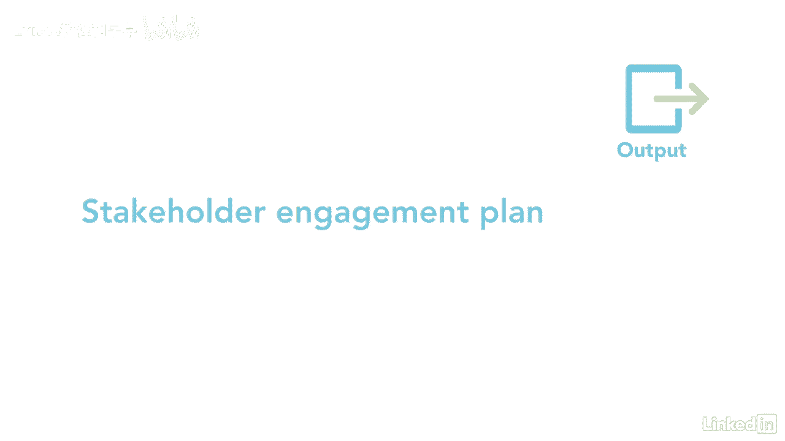

# 061-Lynda教程：项目管理专业人员(PMP)备考指南Cert Prep Project Management Professional (PMP) - P92：chapter_092 - Lynda教程和字幕 - BV1ng411H77g

我曾经有一个利益相关者，他让我的生活很痛苦，这是个问题，因为她是一个主要的团队成员，并做出了项目的大部分决定，我想尽一切办法来改善我们的关系，但什么都不管用，我是说谁能抵挡得了我的魅力，很明显她可以。

当我在收集利益相关者的信息时，我记得有一个我很熟悉的人，他也是她的朋友，我能够利用这种关系来帮助我度过这个艰难的局面，计划的利益攸关方参与，属于规划进程小组，制定与利益攸关方接触和互动的计划。

根据他们的需要，让我们复习一下你可能在考试中看到的内容，对这一进程的第一个主要投入是利益攸关方登记册和协议，登记册提供了项目利益相关者的名单和关于每个利益相关者的信息。

协议提供关于外部利益相关者的信息--在规划时使用这两种信息，如何与他们互动，下一个主要投入是资源沟通和风险管理计划，它们提供了涉众信息，如他们的规则和责任，传播战略和风险阈值。

其他投入包括问题变更和假设日志，其中有关于要求更改的利益相关者的信息和与他们会面时的讨论要点，另一个输入是风险登记册，其中列出了拥有特定风险或可能受其影响的利益相关者，其余的投入是项目时间表。

FS和OPAS现在让我们继续讨论工具和技术，第一个是数据收集，它使用一种叫做基准测试的技术，这是将涉众信息与其他项目或组织进行比较，接下来是数据分析，它包括假设和约束分析方法，以确定利益相关者参与战略。

和根本原因分析，它研究了为什么涉众支持项目，另一种工具和技术是数据表示，它使用了几种不同的技术，第一个是利益攸关方参与评估矩阵，这是一个很好的技术来了解涉众的参与程度，此表顶部有以下参与标准。

目的是查看每个涉众的位置，你希望他们在哪里，例如，字母C代表利益相关者目前的位置，字母d是你希望他们成为利益相关者的地方--一个目前没有意识到的地方，想要的地方是支持的，当你知道这些信息。

可以制定一个计划，将利益相关者从不知道转移到支持，如果你有一个抗拒的人，最低限度的目标是让他们保持中立，所以他们不会伤害项目，第二种技术是思维导图，这是利益相关者之间以及与组织之间关系的可视化表示。

决策是使用优先级和排名，一旦你完成分析，然后利益相关者将被优先考虑和排名，例如，一个有很高兴趣和很高影响力的人会在名单上名列前茅，剩下的工具是专家的，判决和会议，这一进程的唯一产出是利益攸关方参与计划。

本计划将详细说明您可以用来让涉众参与决策的策略和行动。

以及如何让他们参与，记住要积极主动地让利益相关者参与进来，可以成就或破坏你的项目，一定要尽早培养这些关系。

