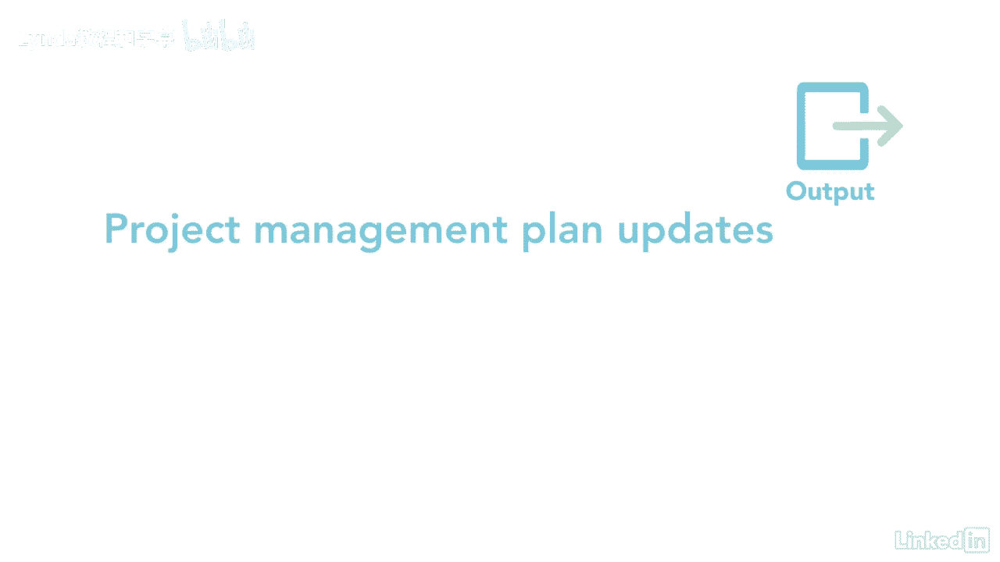

# 061-Lynda教程：项目管理专业人员(PMP)备考指南Cert Prep Project Management Professional (PMP) - P94：chapter_094 - Lynda教程和字幕 - BV1ng411H77g

任何时候我都有一个利益相关者参与计划，我总是确保我与我的利益相关者联系，看看进展如何，我能做些什么来改善沟通吗，或者加强他们的参与，我一直在寻找改进过程的方法，与大多数监视和控制过程一样。

这一个检查看看，如果项目经理让利益相关者参与的计划真的得到了遵循，它着眼于计划与实际，然后根据需要进行更正，控制，利益攸关方的参与属于监测和控制过程组，它监控整个项目。

利益相关者关系和泰勒吸引利益相关者的策略和计划，这个过程有很多ittos，我会复习一下你在考试中可能看到的内容，对这一进程的第一个投入是资源交流和利益攸关方参与计划，和利益相关者登记册。

每个都告诉你谁是利益相关者，以及如何管理他们的需求和期望，和队员们一起，问题日志是此过程的输入，因为项目经理提供了关于已识别的问题和记录的更新，新的，在项目中收集工作绩效数据，并告诉您哪些涉众是支持的。

接下来是项目沟通，比如电子邮件或更新，已分发给利益攸关方，其他投入是风险和教训，学会了，登记册，FS和OPAS，接下来是工具和技术，第一个是数据分析，它着眼于替代方案分析。

这寻求与利益攸关方接触的其他方式，然后是根本原因分析，它着眼于为什么利益相关者的参与不起作用，利益相关者分析检查利益相关者在项目中任何特定时刻的位置，生命周期，其次是决策，使用多标准决策或投票。

另一个是查看利益攸关方参与评估矩阵，并根据涉众现在所处的位置进行更新，接下来是沟通技巧，包括反馈和演示，另一个工具是人际关系和团队技能的使用，这可能包括文化和政治意识，联网。

积极倾听和领导会议是最后的工具和技巧，这一进程的主要产出是变革，请求和工作绩效信息，取决于利益相关者参与的情况，您可能需要提交更改以进行改进，其余产出是项目管理计划和项目文件更新。

为了跟踪项目涉众是否参与项目，监控它们并根据需要做出调整是很重要的。