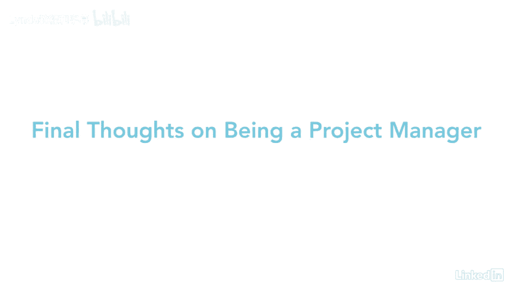

# 061-Lynda教程：项目管理专业人员(PMP)备考指南Cert Prep Project Management Professional (PMP) - P96：chapter_096 - Lynda教程和字幕 - BV1ng411H77g

有一个项目，我参与的一个非常大的项目，那是三年，四年来，我应用了每一个知识领域和每一个过程，原因是这个项目太大了，我们必须确保我们遵循每一个过程，因为通讯，例如真的很大。

我们这个团队里有一百个不同的利益相关者和团队成员，所以通信是我们必须覆盖的巨大领域之一，确保我们以正确的方式与每个人沟通，他们想要的水平，所以这是关键，每个知识领域，并有一个计划，我们将如何管理。

每一个都对项目的成功至关重要，如果我们没有这么多作品，和分散在世界各地的不同的人，我们就不会成功地完成那个项目，所以对我们来说，有一个计划真的很有帮助，按照那个计划，如果有人有任何问题，我们总是可以说。

如果你去这个链接，这是我们的计划，它会告诉你我们在这个项目上所做的一切，所以做一个小项目和做一个大项目是不同的，因为您不需要使用所有的知识领域和所有不同的过程，光是创建文件就得花三个星期。

然后你的项目就结束了，所以最好只是挑挑拣拣，对你的项目最有意义的，我的意思是交流，我再说一遍，沟通真的很大，我总是回到那个问题上，所以你要确保你有一个沟通计划，你将如何与你的利益相关者交谈。

然后需求是另一个大的，所以你需要确保你已经和你的利益相关者谈过了，你已经得到了所有的要求和他们的需求完全理解，这样你就知道如何规划你的项目，所以如果只有三个星期，只需挑选哪些过程最适合您的项目。

然后你就会成功，项目资源有限是项目经理一直面临的问题，要获得所需的资源数量真的很难，所以作为项目经理，最好看看你的项目的完整范围，看看有没有能同时处理多项任务的团队成员。

他们能做你项目中涉及的几项活动吗，如果你能做到，然后你可以看一下这个范围，并确保所包括的一切都能由团队成员完成，你的团队里，最好把这一信息传达给你的所有团队成员，说我们的资源有限，让我们看看整个范围。

弄清楚，我们能做些什么，如果你们作为一个团队一起工作，你们每个人的手指都很合适，然后更有可能的是，您可以完成一个项目与范围，你已经包括了，而且在成本范围内也很好，我管理了一个困难的项目。

这是一个多年的项目，我们的资源遍布日本和爱尔兰，在美国各地，首先让它变得困难的是有所有这些不同的时间表，我们必须让人们见面讨论要求是什么，我们不得不进行视频会议和电话会议。

所有这些以及弄清楚这个项目的范围是很困难的，其中一个原因是，我们没有完全了解这个项目的范围，所以我们不得不坐了几个小时，想知道是什么，我们发现，与其有一个巨大的项目，我们必须把它分成11个不同的项目。

这帮助我们定义了每11个项目的范围，这对我们来说比把所有的东西都塞进一个大项目要好，我们可以把工作平均分配给所有不同的团队成员，所以这也很有帮助，然后我们发现每个人都在世界不同的地方。

这个团队会和日本谈判，这就是他们的范围，这个团队将与爱尔兰对话，并致力于这些不同的活动，这就是他们的范围，这个团队可能会和在美国的人一起工作，这就是他们的范围，所以它帮助我们分解了这一切。

并将项目进行到最后，所有人聚集在一起完成整个节目，我觉得最令人满意的是，做项目经理实际上是和公司里的其他人一起工作，我以前可能没有合作过，然后也发现了公司的一些新东西，我可能不知道公司这么做了。

我参与的大多数项目都是过程改进项目，这真的很有趣，因为我可以改进流程，即使是运行得很好的，所以在公司里认识新朋友并和他们一起工作是很好的，了解他们是做什么的，怎么做的，然后找到一种方法。

我们可以改进过程，因为在任何公司时间就是金钱，所以如果你能缩短时间，使过程更有效率，那你实际上是在为公司省钱，你实际上是在帮助你的同事，因为他们不像以前那样花那么长时间来做这些过程。

所以这是我觉得最令人满意的事情之一，做项目经理，所以作为一个项目经理，我们面临的一个问题是我们没有任何权力，所以我们的权力有限，所以我工作的方法之一，那是我很早就知道的，那个，与团队成员合作。

让他们站在你这边真的很重要，我明白了你必须尊重你的团队成员，明白他们也有白天的工作，不仅仅是你的项目，所以我意识到我需要和每个队员坐下来，并找出他们为什么被分配到我的项目中，亲自了解一下他们。

如果我能和他们面对面坐在一起，那我就这么做，我发现一旦我和他们面对面地坐在一起，和他们交谈，然后我们往往会有更好的工作关系，只要我明白他们还有很多工作要做，他们知道我有事情要做，如果我们一起合作。

那我们就都能在这个项目中取得成功，所以想让人们站在你这边，让他们做他们通常不会做的事情，那是我努力的方向，让人们，我知道他们很忙，但他们想帮我做这个工作，因为我尊重他们。

我知道他们这样做是为了公司的利益，我可以让他们发挥出最好的水平，即使他们没有意识到他们能做到，我可以从他们那里得到工作，所以这是我和团队成员合作的方式之一，让他们做一些他们通常不会做的事情。

所以当项目经理实际上是其中的一部分。

你有当项目经理的经历，但是一旦你坐下来通过了PMP考试，公司会给你压力，因为他们对你期望更高，当PP，嗯，我的建议是欢迎来自贵公司的压力，因为作为回报，你会成为一个更好的项目经理。

比你更好地管理你的项目。