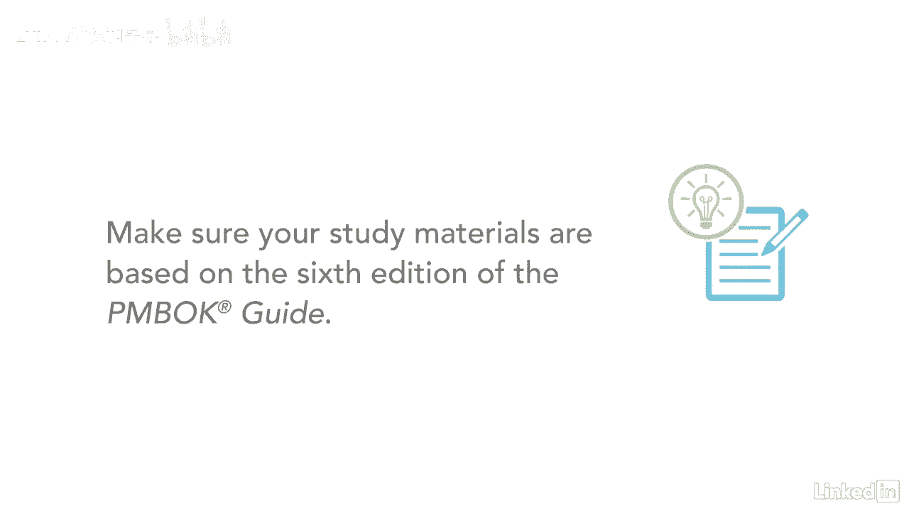

# 061-Lynda教程：项目管理专业人员(PMP)备考指南Cert Prep Project Management Professional (PMP) - P97：chapter_097 - Lynda教程和字幕 - BV1ng411H77g

哇塞，你的pmp考试已经结束了，预科课程，谢谢你加入我，我希望你喜欢这门课，就像我很喜欢和你分享一样，我们已经讨论了很多材料，因此，请随时重温它，不时地温习你的技能，当您继续探索项目管理的世界时。

准备参加pmp考试，记住有五个过程组，十个知识领域和四个九个进程，主要产出之一是项目管理计划，它由18个组件组成，十二项计划，四条基线，项目的描述和方法，我鼓励你再次回顾每一个视频。

直到您对每个知识领域的过程有了充分的理解，最好了解这些过程是如何相互流动的，而不是试图记住所有的输入，工具、技术和产出，本课程的大部分信息来自PIN机器人指南，所以花点时间阅读每一章，视频中引用的。

充分了解材料，Pinbox指南有视频中没有涵盖的其他信息，一定要回顾每一份讲义，练习档案和再次练习考试，直到它成为你的第二天性，更多的学习材料可以在网上找到，这可能会加强你对概念的学习和理解。

只要确保材料是基于当前版本的PIN BOT指南。

当您开始这个过程时，看看我的考试技巧，有申请PMP考试建议的课程，采取策略，更多的是开始你的学习，确保你为你要涵盖的内容制定了一个计划，什么时候和多长时间按照你的计划直到你的考试日期。

也要确保你练习你的大脑倾倒，所以你可以在不到十分钟的时间里写下来，当你考试的时候，记住要以采购经理人指数的方式思考，PMI希望你如何回答这些问题，这一切都与PMI心态有关，当您使用这些过程时，请考虑。

以及你作为项目经理的表现，永远不要委派，拖延或忽视任何事情，你负责，你必须积极主动地处理一切，这是你发光的时候，我为你在学习上走到这一步感到骄傲，继续努力考得好。

