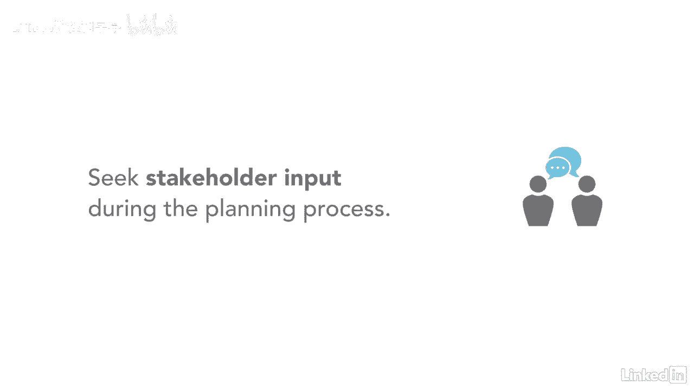

# 061-Lynda教程：项目管理专业人员(PMP)备考指南Cert Prep Project Management Professional (PMP) - P11：chapter_011 - Lynda教程和字幕 - BV1ng411H77g

我相信你听说过计划是很重要的，你需要为你的每个项目做，所以让我们来谈谈在开始工作之前做计划到底意味着什么，我是这么想的，你怎么知道该做什么工作，如果你不知道工作计划是什么，你在哪里回答这个问题。

规划过程组由执行的过程组成，确定工作的总体范围，它还界定和细化了目标，并制定实现这些目标所需的行动方针，你可以在这里看到，规划流程组有很多流程，准确的说是两个四，这是一个创建项目文档的过程。

项目管理计划有18个不同的组成部分，你将用来管理你的项目，作为该进程组的产出制定的项目管理计划和项目文件，将全方位探索范围，时间表和费用，以及优质资源，通信和风险，更不用说采购和利益相关者了。

因为您是在项目开始时创建这些文档的，有机会，有些项目需要在整个项目生命周期中更新一次或多次，更新可能来自更改请求，或执行计划时的发现，这些对项目管理计划的渐进式更改称为渐进细化。

它是在项目管理计划中增加细节的迭代过程，随着获得更多的信息和更准确的估计，循序渐进的阐述是一个你需要记住的术语，因为这是考试中的一个热门问题，现在，规划过程组有几个关键的好处，第一。

从相关利益攸关方收到投入，接下来，它帮助您确定成功完成项目或阶段的行动过程，在这一过程中寻求利益攸关方的投入和参与是很重要的，他们的信息是用来形成项目管理计划和项目文件的。

让他们了解对这些文档所做的任何更改也很重要，规划过程对任何项目都是必不可少的，这一切都是为了制定一个计划并执行这个计划，我以前做过项目，团队成员想在没有计划的情况下开始执行，结果是灾难性的。

在执行前完成计划过程对项目的成功至关重要。