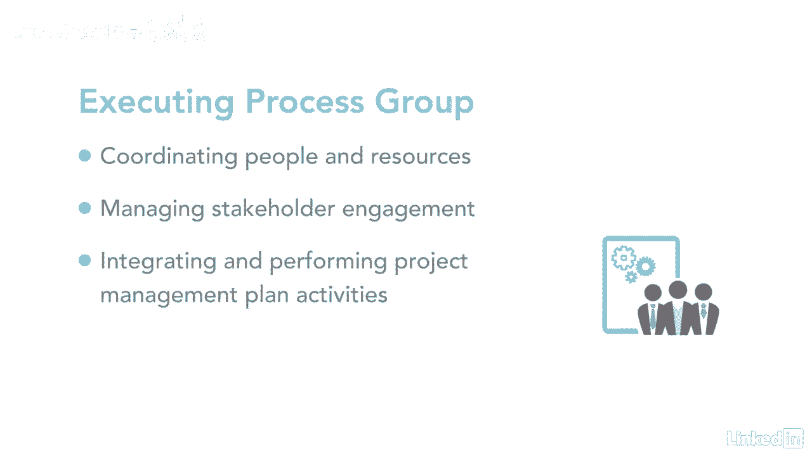

# 061-Lynda教程：项目管理专业人员(PMP)备考指南Cert Prep Project Management Professional (PMP) - P12：chapter_012 - Lynda教程和字幕 - BV1ng411H77g

你花了很多时间计划你的项目，现在您已经准备好按照您的项目管理计划开始执行它了，这就是你和你的团队创造一些东西的乐趣所在，过程相对容易讨论，让我分享一个概述，你可以在这里看到，执行过程组由八个过程组成。

执行这些过程以确保，项目管理计划中的所有工作都是为了满足项目要求而完成的，项目预算的很大一部分用于执行阶段，这是因为您已经开始使用分配给项目的资源。

这个流程组涉及人员和资源的协调以及管理利益攸关方的参与，以及整合和执行项目管理计划中详细说明的活动。

您可能会发现在项目执行期间需要进行更改，就像活动的持续时间，或因意外风险，这些更改可以触发更改请求，如获批准，可修改项目管理计划或其他项目文件，您甚至可能需要建立新的基线，执行过程是所有工作完成的地方。

它确保项目团队确切地知道他们在做什么，它还确保变更通过变更控制得到适当的审查。