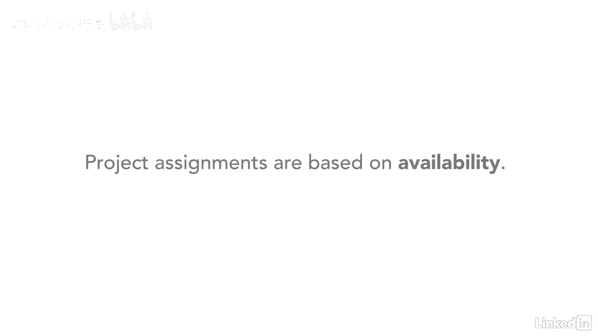

# 061-Lynda教程：项目管理专业人员(PMP)备考指南Cert Prep Project Management Professional (PMP) - P14：chapter_014 - Lynda教程和字幕 - BV1ng411H77g

你是否曾经有过一个项目，你以为完成了，却接到了一个又一个电话，让你处理一个问题，这表明这个项目可能没有成功地结束，让我们看看为什么这个过程组在关闭过程组中如此重要，您要确保其他组定义的所有流程都已完成。

允许您正式结束项目，阶段或合同，这意味着接管产品的人或组织，结果或过程已正式接受，将您从项目中释放，此过程还包括在项目过早关闭的情况下该怎么办，例如中止或取消的项目，关闭过程组是最容易的。

只有一个进程要执行，如您在这里看到的，您还会注意到这是集成管理知识区域中的一个流程，另一点是，如果接收，组织或部门希望在项目结束后立即进行更改，他们同意做出这些改变或要求一个新项目是他们的责任。

可能会也可能不会分配给你，这种事曾经发生在我身上，接收组织自动假设，我将是管理额外工作的人，因为我一开始是项目经理，现实是，项目被分配给当时有空的人。

不一定是对项目最熟悉的人，结束一个项目是一个关键的过程，它确保所有工作完成，吸取经验教训，项目文件已存档，所有合同已结束，它确保你不会经常被拉回它。

