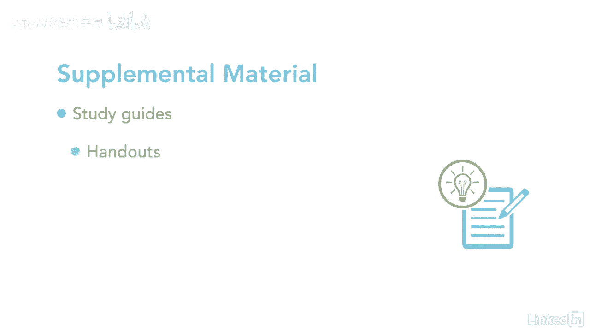

# 061-Lynda教程：项目管理专业人员(PMP)备考指南Cert Prep Project Management Professional (PMP) - P1：chapter_001 - Lynda教程和字幕 - BV1ng411H77g

在当今竞争激烈的工作场所，这对公司的利润至关重要，使项目得到有效和高效的管理，这就是为什么PP认证如此重要，获得项目管理专业认证绝非易事，需要多年的项目管理经验，三五个小时的教育，你一定要通过考试。

这就是这门课的目的，帮助你准备考试，我是桑迪米切尔，我已经当了两个五年的项目经理，我已经帮助数百名学生准备这门课的考试，我会教你你需要知道的，通过PMP考试，我将涵盖五个过程组。

PIN BOT指南中的十个知识领域和四个九个过程，我会提供关于考试主题的信息，但指南里没有，另外还有一些补充材料，包括学习的人，讲义和练习考试。

老实说，这将有助于你学习材料，这次考试是最难的考试之一，你将永远，学习材料需要努力和奉献，但有了这门课。

