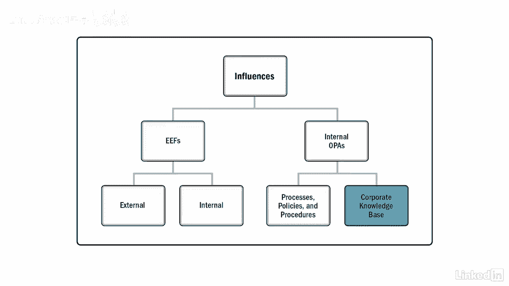

# 061-Lynda教程：项目管理专业人员(PMP)备考指南Cert Prep Project Management Professional (PMP) - P20：chapter_020 - Lynda教程和字幕 - BV1ng411H77g

所以我在西海岸生活和工作，我工作过的公司，有一种你可以走进去的文化，穿着短裤，人字拖，甚至粉红色的弗洛伊德T恤，现在我不一定建议上班时穿成那样，但我们只能说这是一个非常轻松的气氛。

现在我也在东海岸工作过，那里的标准是每天不穿衣服，不管是休闲的还是正式的，这些类型的环境确实会影响您的项目，让我们在这里讨论他们中的几个，你可以看到企业，环境因素，或e和组织流程资产，也被称为作品。

对项目有重大影响，FS是影响项目的力，你根本控制不了，这些力量可能来自公司内部，就像我之前举的关于公司文化的例子，也可以从外面来，就像外部政治条件，其他一些内部例子可能是公司所在的地方。

以及你是否有虚拟团队，另一个例子是结构，如现有设施设备，有了那个设备，你有吗，文档管理系统和调度等功能，软件工具，最后一个，现在有哪些人力资源，他们的技能和能力是什么。

让我们通过考虑重塑你的房子来看看外部影响，只要有新的电力或管道安装，检查员必须确保工作符合要求，你所在城市的建筑规范，这是一个外部影响的例子--你无法控制他们，你基本上任由他们摆布。

当他们检查你的房子时，他们是否批准这项工作，公司也要和检查员打交道，以及其他外部影响，如市场条件，例如，竞争对手和市场份额，你还需要考虑是否有法律限制，可能还有与外国的汇率。

这些只是你无法控制的一些影响，但我相信你能想到一些你现在每天都可能遇到的事情，让我们来谈谈组织流程资产或OPAS，这些都是来自公司内部的东西，例如，以前和目前项目的文件，如项目计划和经验教训。

也有公司政策，标准作业程序和数据库，存储信息的地方，Opus还可能包含用于项目的模板，例如特许状，登记册和图则，这些都影响了项目的管理，我喜欢把它们看作是历史信息，就像读一本历史书。

看看过去的事情是怎么做的，作品中的文物可以分为两个不同的桶，第一个是过程，政策和程序，它们只能通过遵循公司的政策和流程来更新，过程，政策和程序在启动和规划时按五个进程组细分。

您可能有开始创建项目文档所需的模板，也许还有一份预先批准的供应商名单，监测和控制，您可以更改控制程序，如何管理缺陷，以及你将如何验证和验证，最后完成的工作，您将有如何结束项目的指导方针。

以及是否有需要满足的要求，随着项目向运营或生产的转移，二是组织知识数据库，可能在项目期间更新，列入项目文件，比如预算和项目绩效。

我们的项目确实存在并在可能产生也可能不会产生有利影响的环境中运行，记住这取决于作为项目经理的你，去尝试理解这些影响是什么，所以你不会发现自己走进会议室。

