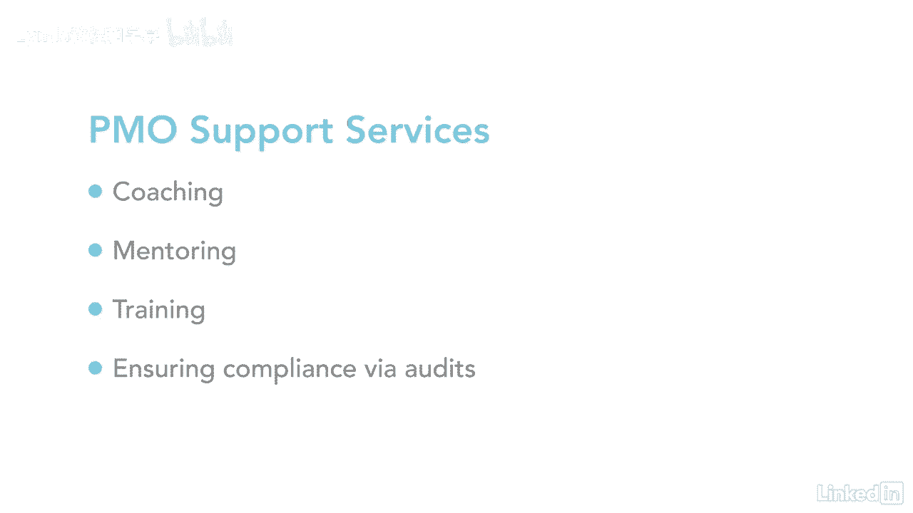

# 061-Lynda教程：项目管理专业人员(PMP)备考指南Cert Prep Project Management Professional (PMP) - P22：chapter_022 - Lynda教程和字幕 - BV1ng411H77g

在我职业生涯的早期，我被分配了一个有点令人沮丧的项目，因为我什么都做不成，我当时不明白的是，我工作的组织是功能性的，意思是人们按他们的专业领域分组，项目经理几乎没有权力，我从那个项目中学到了宝贵的一课。

组织类型确实很重要，如果您想控制您的项目，组织结构类型是现在组织系统的一种形式，除非你拥有自己的公司或正在帮助创办一家公司，你可能不会参与决定组织结构，但以防万一，这里有几个因素需要考虑。

企业是否具备专业化能力，另外，还有成本考虑和物理位置，就像砖头和灰泥还是虚拟的，以及识别，谁将对需要做的行动或活动负责，一旦考虑到这些因素，需要就，最适合公司的组织结构类型，这张桌子做得很好。

显示不同的结构类型和权限级别，项目经理有，让我们来看看面向项目的结构类型，所以你可以看到这个表是如何流动的，您会注意到左边的工作组是按项目安排的，这意味着团队成员和项目经理全职工作在这个项目上。

他们不做其他任何事情，您可能会注意到的另一点是，项目经理几乎完全控制资源，他们几乎总是可以参与这个项目，那是因为他们最后直接向项目经理汇报，项目经理负责预算，幸运的是，有一个全职工作人员帮助管理项目。

在这个表的最下面是项目管理办公室，PMO实际上有三种类型，每个人都有不同程度的权力，第一个是支助性的，主要是项目咨询人的职能，他们几乎无法控制，他们的主要重点是提供模板，推荐的最佳做法培训。

以及经验教训和其他项目文件的文件储存库，下一个是控制，这也是支持，但也需要合规，其形式可以是管理框架或方法，强制使用模板，表单或工具，并遵守治理框架，如遵循规则和政策，它的控制水平是中等的。

最后一种PMO类型是指令性的，它是指项目管理办公室控制项目管理的时候，项目经理直接向项目经理汇报，管控程度高，PO的几个关键功能是评估投资组合，查看正在进行的项目和程序，与公司高层目标保持一致。

另一个是衡量项目和计划是否给组织带来价值，这样做的一种方法是提出建议，并在必要时可能终止项目，pmos的另一个特点是通过在所有项目中提供共享资源来支持项目经理，由PMO管理。

确定和制定项目管理方法以及最佳做法和标准，其他服务可能包括辅导，指导和培训，并通过作为项目经理执行定期审计来确保项目保持遵从性。

知道你在为哪种类型的组织工作是很重要的，因为它将决定您对项目和资源的权限级别。