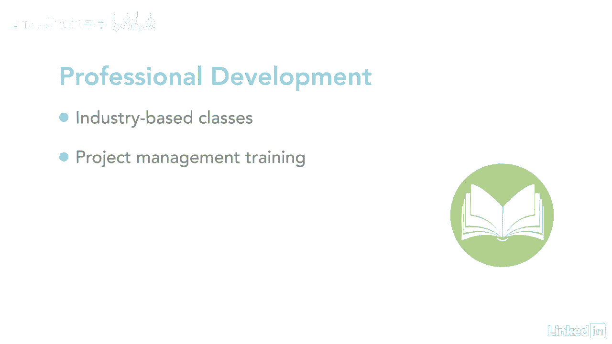

# 061-Lynda教程：项目管理专业人员(PMP)备考指南Cert Prep Project Management Professional (PMP) - P24：chapter_024 - Lynda教程和字幕 - BV1ng411H77g

你看了这个标题摇头了吗，问什么是势力范围，别难过，我也是，这样想吧，你的势力范围是你关系网中的人，你的意见对他有一定的分量，这可以是你的朋友，同行，同事或管理人员，一旦你知道这些人是谁。

你可以努力改善与他们的沟通，所以你可以从事更有意义的方式，你可以在这里看到你位于中心位置，对自己影响最大，当你搬出去的时候，或远离球心，你逐渐失去你的力量，下一个球体是项目团队。

而那些在这个角色中管理资源的人，你对你的团队仍然有巨大的影响力，因为你一直在和他们交流，和你的资源管理人员，您确保每个项目都是最新的项目交付品，并提供方向，项目成功的愿景是什么，下一批人。

你对我们的赞助商有一定的影响力，理事机构和其他利益攸关方，包括供应商和客户，这些人可以帮助你的项目，通过提供支持，指导和决策，以便您继续执行您的计划，他们还资助你的项目，并在关闭期间继续资助它。

你的影响程度取决于你如何让他们了解项目可交付成果的最新情况，如果他们相信你管理得很好，你看不到的是，项目经理需要与项目中的其他项目经理互动，因为每个项目都会对其他项目产生影响，例如。

项目之间可能有共享资源，规划它们的时间是必要的，所以在需要的时候它们是可用的，不断的沟通是关键，为了确保成功，项目经理还必须了解行业趋势，这样他们就可以看到是否有任何可能帮助或损害他们的项目，例如。

我在制药公司工作，我负责的项目是更新监管标准，我需要知道我们被要求遵守的标准，如果在不久的将来有任何变化，往那边走，我们可以把修改纳入我们目前正在做的工作中，项目经理继续专业发展是很重要的。

这可能包括基于行业的课程或项目管理培训。

它还包括通过在项目管理实践中培训团队成员来分享您的知识，尤其是如果你使用的是不同的管理方法，像敏捷，大家可以看到，项目经理影响范围广，想想你所有的关系。

