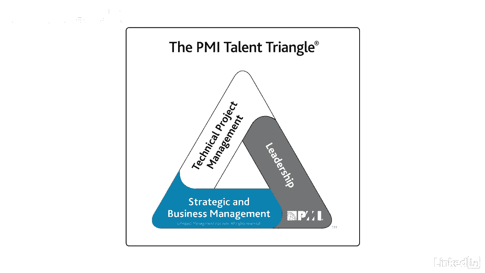

# 061-Lynda教程：项目管理专业人员(PMP)备考指南Cert Prep Project Management Professional (PMP) - P25：chapter_025 - Lynda教程和字幕 - BV1ng411H77g

我记得那些日子，我只是出现在工作中，管理着，不管哪个项目交给我，没有必要成为PMP，另外，我是否知道商业战略或公司目标并不重要，重要的是我在预算范围内按时完成了这个项目，令人惊讶的是。

如果我对项目管理了解很多，这并不重要，只要我今天把工作做完，这是一个完全不同的故事，需求变了，不仅PP几乎总是必需的，但是项目经理需要了解所谓的采购经理人人才三角，你可以在这里看到。

你不仅需要有项目管理方面的技术技能，你需要成为一个领导者，并意识到战略和业务管理，技术项目管理正在具备技能，一个或多个项目管理领域的知识和行为，如项目计划和项目组合管理，这些技能。

或者你通常对项目经理的期望，就像管理成本的三重约束，范围和时间表，加风险，更不用说理解工作的适当规划和优先顺序了，另一项技能是知道哪种项目管理方法最适合团队，像适应性或预测性这样执行的工作。

项目经理也被期望成为领导者，即使他们没有太多的权力或权威，事实上，在这种情况下，他们需要更多的领导者，因为他们不能让球队做任何事，他们需要让团队相信项目愿景，然后激励他们朝着那个方向前进。

现在我喜欢当领导，我觉得我生来就是做这件事的，这些年来，我磨练了一些技能，这些技能使我成功了，例如，我倾向于一个乐观主义者，即使在艰难的时候，但我也是一个现实主义者，所以我会说实话，好或坏。

我对我的团队也很诚实，当他们做错事时，会追究他们的责任，但我也会称赞他们的工作，干得好，我对每个人都一样，不管他们的立场如何，我相信合作，因为问题往往解决得更快，当我们一起工作，我也有门户开放政策。

在那里可以对我或关于我的任何事情，我听我的团队说话，我总是表现出尊重，我们并不都是天生的领导者，但这是一套可以学习的技能，别针盒里有几个项目经理素质的列表，包括政治权力，花点时间阅读关于领导力的部分。

重要的是要知道管理和领导是有区别的，他们不是同义词，管理层只是确保工作完成，领导力是通过引导某人从a点到b点来让他们做工作，项目经理需要平衡领导和管理，在管理项目时，你可以使用一系列的领导风格。

我就列举几个，一个例子是自由放任，这意味着你允许团队设定自己的目标，做出自己的决定，你基本上不插手，另一个是仆人领袖，它表明了服务他人和把他人放在第一位的承诺，还有事务性的，专注于目标，反馈和成就。

确定奖励，这就是所谓的管理，例外，最后一套技能是战略和业务管理，并要求项目经理知道公司的目标和目的是什么，这样他们就可以看到项目是否支持战略调整。

可能包括有制造方面的知识，财务或业务，从本质上讲，项目经理应该能够解释他们的项目是如何与业务联系在一起的，记住人才三角是关于让项目经理更全面，你在这三个方面越有能力。

