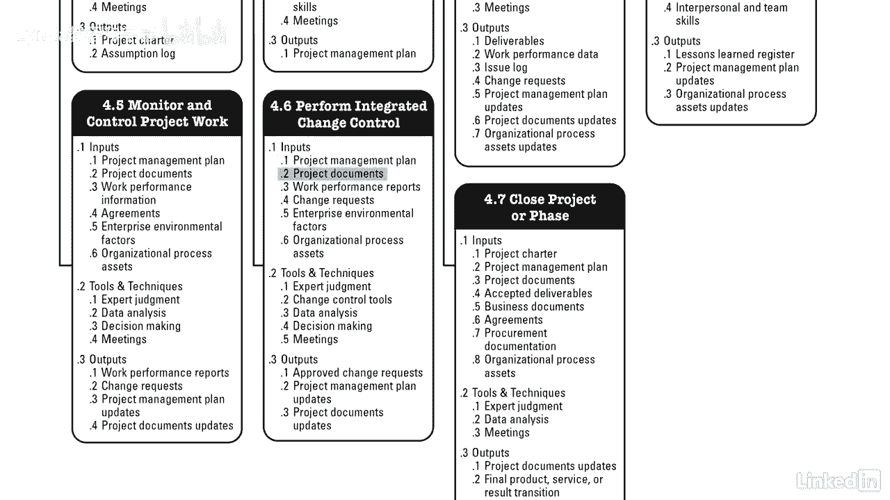

# 061-Lynda教程：项目管理专业人员(PMP)备考指南Cert Prep Project Management Professional (PMP) - P26：chapter_026 - Lynda教程和字幕 - BV1ng411H77g

你听过那句古老的格言吗？不能透过树木看到森林，项目管理有点像只看到树，专注于完成项目完成的任务，作为项目经理，看森林很重要，或者如何协调项目的所有部分以使项目成功。

让我们深入探讨为什么集成管理对项目成功如此重要，集成管理是将Pinbot指南中的所有知识领域联系在一起的东西，首先讨论集成知识领域，因为它是贯穿所有过程的线，让他们在一起，这叫整合。

因为当对项目进行更改时，它必须与项目的其他领域相结合，例如，如果更改范围，可能会影响成本，质量，时间，资源，风险，或其他知识领域，对项目经理来说，了解这些变化是很重要的，并在其他知识领域中协调它们。

项目集成也是关于提供项目管理计划，因此，项目目标可以实现，并管理阶段转换，必要时，它管理项目管理计划中活动的性能和变化，在对影响项目的更改做出决策时，它包括收集和分析数据，并将结果传达给相关利益攸关方。

最后是关于完成所有的项目工作和结束每个阶段的合同，整个项目，在这张图中，您可以看到所有不同的过程，他们的投入，工具、技术和产出，也被称为ITTOS，您将注意到输出现在是输入，到一个或多个其他进程，例如。

让我们看看开发项目章程的输出，他们的项目章程和假设日志，项目章程现在是下一个过程的投入，下一个过程是制定项目管理计划，另一个我们可以看的是监控项目工作，其产出是工作业绩报告，更改请求，项目管理计划。

和项目文件，更新，执行集成变更控制的输入，我们的项目管理计划，项目文件。

工作业绩报告和变更请求，大家可以看到，集成管理知识区域是维系整个项目的粘合剂，作为项目经理，了解属于这一知识领域的过程是很重要的，协调项目不同部分的努力，将帮助项目按时完成并保持在预算范围内。

