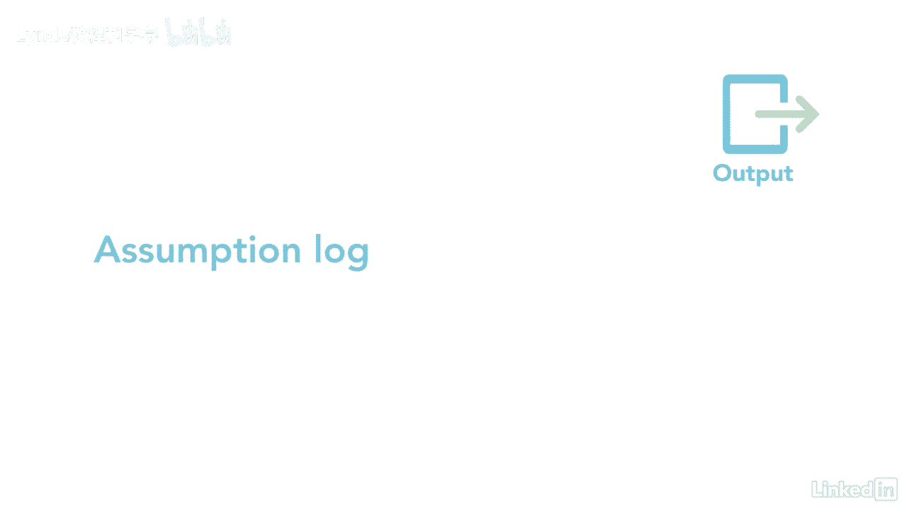

# 061-Lynda教程：项目管理专业人员(PMP)备考指南Cert Prep Project Management Professional (PMP) - P28：chapter_028 - Lynda教程和字幕 - BV1ng411H77g

集成知识领域的第一个过程是作为项目经理开发项目章程，在项目开始之前，必须有一个经批准的章程，毕竟章程是任命项目经理的，并在开发项目章程中正式启动项目，创建正式批准项目的文档。

指派项目经理并授予他们使用资源的权限，主要好处是创建了项目的正式记录，这对高级管理层来说是一种直接的方式，正式接受并承诺项目，章程确认项目对标，本组织的战略和正在进行的工作，查看此过程的ittos。

记住赞助商制定了一个章程，但建议在起草时确定项目经理，因此，他们可以了解目的和目标，并协助开发过程，如果工作将由外部组织完成，现在正式合同里有详细规定，让我们看一下这个图表，中间的灰色方框是过程。

输入进入过程，在左手边，输出在右手边输出，您可以看到项目章程和假设日志，项目章程是对其他进程的投入，这是开发项目章程过程的高级视图，让我们谈谈一些关键领域，你更有可能在考试中看到。

我鼓励你回去阅读针盒的细节，关于每一个伊托，由业务案例和利益组成的业务文档，管理计划用于制定章程，并包括帮助组织做出决定的信息，关于一个项目是否会给公司带来价值，这方面的例子可包括成本效益分析。

而需要的是什么，例如客户要求或法规要求和项目选择方法，下一个输入是协议，也称为合同，你可能会在考试中看到任何一个学期，它们的意思是一样的，其他形式的协议是谅解备忘录，服务级别协议和电子邮件。

甚至有口头协议，其他投入和操作也应考虑，为了完成这一进程的工作，你需要工具和技巧，一是专家判断，哪些是你的主题专家，这些是你去找的人，当你需要一个特定领域的专家，他们可能有特殊的技能教育或培训。

你对专家的选择取决于所需的问题或信息，这就像问木匠厨房橱柜的事，第二个工具和技术是数据收集，在项目管理过程和指南中有广泛的应用，制定项目章程，数据收集的例子是集思广益，在那里每个人都抛出想法。

然后是焦点小组，最后是采访，另一个是人际交往和团队合作能力，其中包括冲突管理，促进技能和会议管理，所有这些都要求你成为一个好的沟通者，并有条理，最后一个工具和技巧是在你试图获得信息的任何时候开会。

最好亲自去做，通常是面对面的宪章，这些会议的目的是收集高级信息，关于项目，就像项目目标一样，记住所有这些都是高水平的，细节将在稍后讨论范围和时间表时公布，一旦你创建了宪章，它成为这个过程的输出。

章程包括关于该项目的基本信息，其中可能包括项目的目的或理由，预先批准的预算，也许是一两个利益相关者，最重要的是，它分配项目经理，精确指南，有一份完整的宪章项目清单，这个过程的最终输出是假设日志。

这抓住了高层。

项目整个生命周期中的假设和约束，大家可以看到，章程中有很多关于这个项目的信息，用它，你可以保证，该项目已获批准。

