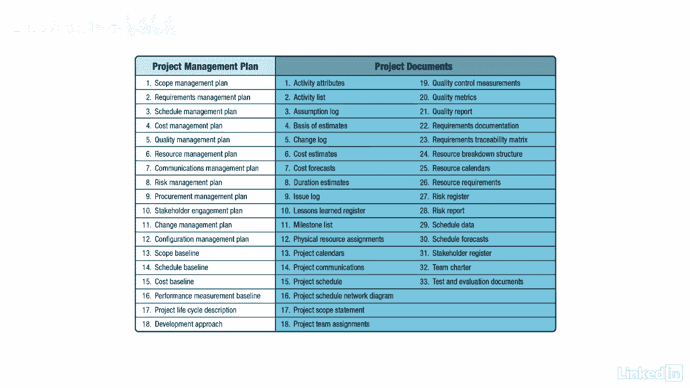

# 061-Lynda教程：项目管理专业人员(PMP)备考指南Cert Prep Project Management Professional (PMP) - P29：chapter_029 - Lynda教程和字幕 - BV1ng411H77g

一旦您创建了项目章程，下一个流程步骤是创建项目管理计划，也被简称为计划，多少次有人向你要项目计划，当你把它交给他们，他们说不，那不是我想要的，我想看看有活动和日期的计划，意思是项目的时间表，别难过。

这种事经常发生，计划这个词经常被误认为是时间表，我来解释一下什么是项目管理计划，你很快就会看到它们有什么不同，在项目章程获得批准后，您立即开始起草项目管理计划。

项目管理计划提供了管理和执行项目所需的所有信息，包括如何监视和控制它直到关闭，项目管理计划经常通过所谓的逐步细化来审查和修订，这是一个反复的过程，当发现更详细的信息和估计数时，计划被修改。

就像写研究论文一样，你从你现在知道的信息开始，但是当你收集更多的信息或事实，文件被修改，直到你得到最终副本，递进阐述是一道热门考题，所以当你看到它的时候能够识别它的定义，以下是这个过程的ittos。

一个关键的输入是项目章程，它是开发项目章程过程的输出，另一个输入将是来自其他过程的计划，如质量管理和范围，在制定项目管理计划时，您应该始终考虑和执行，因为有有价值的历史信息可能对你的项目有帮助。

包括专家判断在内的工具和技术，数据收集，在开发项目章程过程中，人际和团队技能以及会议可能看起来很熟悉，唯一的变化是将核对表作为一种选项添加到数据收集中。

可以使用核对表来确保在项目管理计划中捕获所有所需的信息，此过程的唯一输出是项目管理计划，你会在这张桌子上看到，在管理一个项目时，有相当多的组件，左边的项目将是项目管理计划的一部分。

而右边的项目不包括在计划中，但它们将被用来帮助管理项目，项目进度只是项目管理计划中的一个项目。

如果这对你来说不是常见的做法，为项目创建项目管理计划。