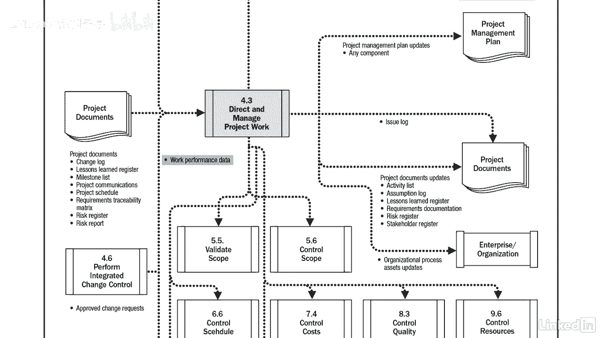

# 061-Lynda教程：项目管理专业人员(PMP)备考指南Cert Prep Project Management Professional (PMP) - P30：chapter_030 - Lynda教程和字幕 - BV1ng411H77g

你看过管弦乐队表演吗？你可能已经注意到站在前面的售票员了，挥舞着指挥棒，当涉及到项目时，项目经理相当于列车长，您必须指导和管理项目计划中定义的工作，我打赌你不知道你可以在简历上加上指挥，你在计划过程组。

您创建了项目管理计划，详细说明了你的项目所需的所有工作，直接和管理的项目工作过程，就是你实际构建你在计划中详细说明的项目的地方，例如一座桥，数据库或新的游戏系统，您还收集工作绩效数据。

生成更改请求并执行经批准的更改所产生的任何工作，您可以看到此过程的ittos，需要注意的是，这是一个迭代过程，当你指导和管理工作时，您将生成性能数据，它会告诉你你是否达到了目标，如果没有。

您可以生成更改请求，使项目回到计划中，您将看到更改请求是此过程的输出，但是批准的变更请求是一种输入，所以这就是为什么它是一个迭代的过程，批准的变更请求是此流程的输入，请记住。

只有经过批准的更改请求才会被执行，你可能会在考试中看到一个关于这个的问题，其他输入，项目管理，计划和作品都是共同的投入，应该在这个过程中考虑，另一个输入是项目文档，其中可能包括更改日志，以及教训。

学习或风险登记册，以及带有里程碑列表的项目时间表，除了项目沟通和需求，溯源矩阵，专家判断，项目管理信息系统和会议都是通用的工具和技术，这一过程的一个产出是可交付成果，这是完成的实际产品结果或能力。

因此项目阶段或过程可以完成，另一个输出是工作绩效数据，哪些是由正在执行的工作产生的原始测量值，在分析之前，例如，测量是半英寸，下一个输出是问题日志，当你管理这个项目的时候，会有问题的时候。

出现不一致或冲突，在它们影响项目之前，您需要立即解决这些问题，问题日志是您捕获这些项的地方，另一个输出是更改请求，可能出于多种原因生成更改请求，例如，纠正和预防措施有助于重新调整项目工作的绩效。

与项目管理计划或缺陷修复，修改不合格品或产品组件，以及对任何正式控制的项目文件的更新，终于，最后两项产出是项目管理计划和项目文件，收到对项目的批准更改时的更新。

检查这些文档以确定它们是否需要更新总是很重要的，很可能他们需要，我真的很喜欢这个图形，因为它向您展示了受该流程输出影响的所有其他流程，例如，工作绩效数据流入每个控制和监控过程，比如控制时间表或监控通信。

正如你所知，这是整个项目中的一个关键过程，你可以整天计划，但在你真正建造一些东西之前，只是一个计划，当你回顾你的项目，是否有类似的项目管理流程，如果没有，也许你可以实现一个。

