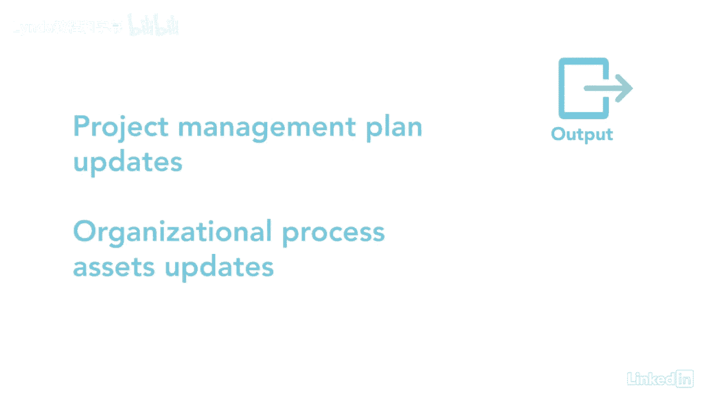

# 061-Lynda教程：项目管理专业人员(PMP)备考指南Cert Prep Project Management Professional (PMP) - P31：chapter_031 - Lynda教程和字幕 - BV1ng411H77g

在管理项目知识过程中，这个想法是利用你现有的知识，这可以创建用于帮助项目结果或用于组织其他地方的新知识，康奈尔大学做过一项有趣的研究，他们发现，组织知识的创造取决于团队成员的交流能力，并结合现有信息。

知识和思想，他们说，当拥有不同水平和不同知识的人开始结合他们的想法时，它们创造了新的潜在知识，当这些知识得到验证，例如通过测试，市场营销或其他实验，它转化为新的知识，现在呢，知识可以分为两类。

第一种是明确的，易于表达，如文字，数字或图片，第二种是默契的，不那么容易表达，因为这是个人的私事，组织希望利用显性和隐性知识之前，项目期间和之后，所以他们可以采取措施记录尽可能多的信息。

有一个鼓励共享隐性信息的环境也很重要，这个过程相当容易记住，因为我有意义，让我们来看看他们，第一个输入是项目文档，其中可能包括一个经验教训登记册，具有资源细分结构和利益相关者登记册的项目团队分配。

接下来是项目交付品，这些通常是有形的，来自团队所做的工作，其他输入，项目管理计划，E和OPAS，都是常见的输入，在考虑项目知识时应考虑，专家判断是关键工具和技术，因为专家有你需要的知识。

知识管理是另一个重要的工具和技术，因为这就是如何让人们聚集在一起创造新的知识，这方面的例子可能包括网络会议和讨论论坛，另一个分享知识的好方法是跟踪，这是指一个人跟随另一个人一段时间。

并了解那个人的所作所为，类似于知识管理，信息管理被用来连接人们与新的和历史的知识，例子可包括经验教训，学会了，图书馆事务，还有经前综合症，它提供对文档管理系统的访问。

最后一个工具和技巧是人际交往和团队合作技巧，这可能是网络和政治意识，这需要积极的倾听，它还包括促进和领导，这一进程的主要产出之一是经验教训登记册，这捕获了问题，挑战，风险，项目进展顺利或需要改进的地方。

然后将该登记册转移到经验教训储存库，所以其他球队可以从中受益，项目管理计划更新和组织流程更新是最后的产出。

在这个过程中可能需要改变，现在您对什么是项目知识有了更好的理解，想想你将采取哪些步骤从你的团队成员那里获得知识。

