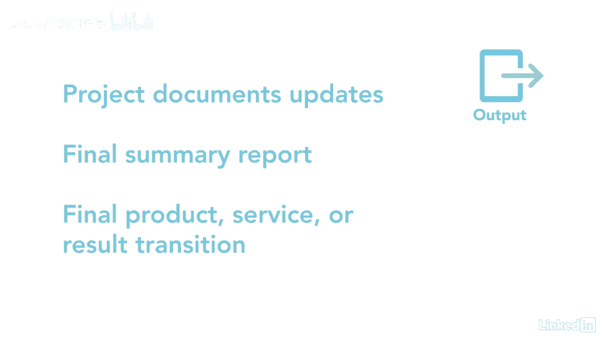

# 061-Lynda教程：项目管理专业人员(PMP)备考指南Cert Prep Project Management Professional (PMP) - P34：chapter_034 - Lynda教程和字幕 - BV1ng411H77g

天下没有不散的筵席，俗话说，你的项目就是其中之一，作为项目经理，项目关闭可能苦乐参半，一方面，我很高兴把项目结果交给它的步枪主人，另一方面，我很难过一个项目完成了，因为我会想念我的团队，不管。

为了结束一个项目或阶段，需要采取几个步骤，我们去找他们，结束项目或阶段，是确保完成所有项目活动的正式过程，这是项目经理的责任，确保项目管理计划中确定的项目目标已经实现一次，你验证一下。

然后一个项目要么进入下一阶段，或者项目结果得到正式签字并移交给业主，然后所有的项目文档都被存档，资源被释放，如果项目提前结束，结束项目允许项目经理与涉众讨论这些行动，并记录原因。

让我们看看这个过程的ittos，此过程的输入列表很长，从项目章程和项目管理计划开始，章程提供了项目成功的标准，并确定了谁将在项目上签字，项目管理计划有关于所做工作的细节，下一个是项目文档。

而且名单很广泛，所以我只讨论其中的几个，但一定要回顾一下整个列表，有几个日志包括假设，更改和发布日志，还有里程碑名单，估计数和项目通信的依据，当然，还有经验教训登记册，在整个项目中都在更新。

接受此过程的关键输入之一，交付品，这可以是您创建的实际产品或批准的产品规格，交货收据和工作表现文件，另外两项投入是业务论证和效益管理计划，其中提供了关于业务需求和项目目标效益的详细信息。

其次是采购文件和协议，协议告诉你如何正式结束采购，采购文件需要收集和存档，最后一个输入是组织流程资产，它有项目或阶段关闭指南，以及存储项目文档的配置知识库，这个过程有三种工具和技术。

你在其他过程中也见过，专家判断，它吸引了那些可能拥有结束项目或阶段所需信息的人，像法律或审计员，另一个是数据分析，使用像文件分析这样的技术，回归与趋势分析，或方差分析，会议是最后一次。

它用于收集我们在项目或阶段结束中讨论过的所有信息，就像确认所有的项目交付已经被接受，吸取或收集的经验教训，并检查涉众是否满意，别忘了庆祝，取决于团队所在的位置，这些会议可以面对面，虚拟或两者兼而有之。

对于输出，它们可以是正式的或非正式的，您需要更新项目文档，并提供关于项目执行情况的摘要报告，一个，其他输出是最终产品服务或结果转换，即正式移交给不同的团体或组织，所以他们可以操作。

维护，并支持它度过生命周期，是呀，即使是我们最喜欢的项目也必须结束，这个过程的中心是确保项目目标已经实现，这也是关于正式结束项目和存储项目文件，所以它们可以作为将来的参考。

所以一定要确保你正式结束了你的项目。