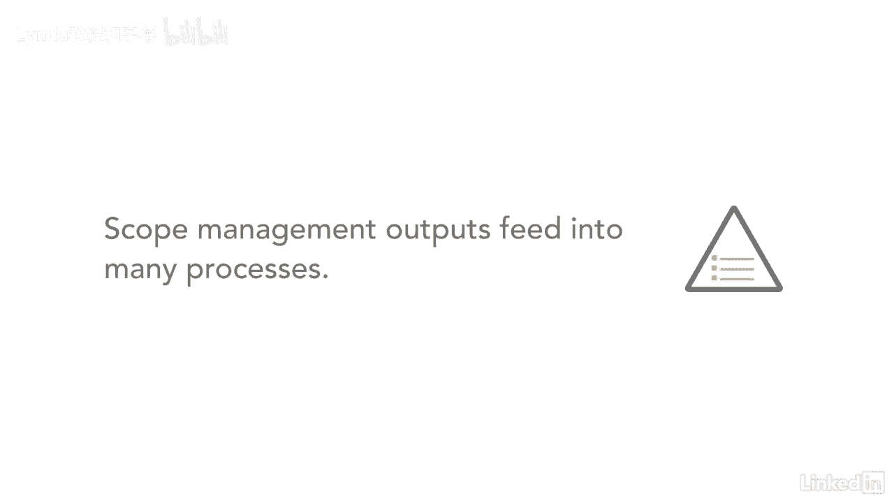

# 061-Lynda教程：项目管理专业人员(PMP)备考指南Cert Prep Project Management Professional (PMP) - P35：chapter_035 - Lynda教程和字幕 - BV1ng411H77g

我记得，我姐姐结婚的时候，她说婚礼很简单，没什么奢侈的，只有几个家人和朋友，随着计划的继续，越来越多的人不断增加，婚礼费用翻了两番，结果失控了，项目也是这样开始的，范围确定，工作启动。

但是变化一个接一个地悄悄出现，直到你超出预算，落后于计划，这被称为范围蠕变，这对任何项目都很糟糕，范围管理知识领域包括如何确定项目和产品范围，以及在项目完成时控制它的步骤。

范围将根据项目管理计划进行衡量，意思是你说到做到，你会做的，产品的范围也将根据要求进行测量，就像，颜色高度对吗，重量，每平方英寸磅以此类推，看看流程和ITTO，在这个知识领域有六个过程。

而规划过程中的每一个都需要按顺序去做，例如，范围管理计划是第一位的，然后您接下来收集需求，定义作用域，然后创建工作分解结构或WBS，你不能创建WBS，除非你知道什么在范围内，当我们开始讨论不同的过程。

这将变得更加清楚，这个知识领域有60多个ittos，但别让这吓到你，因为流程是按逻辑顺序流动的，如果你想想每个过程是如何流入下一个过程的，它会开始变得有意义，也会更容易记住，了解范围。

管理流程对考试很重要，因为输出输入到许多其他过程中。

这也很重要，因为一个项目团队应该只完成工作，那是在范围内，禁止镀金，这意味着将不包括在范围内的工作添加到项目中，你希望你的项目成功，而这是通过保持在你的范围顶部来完成的。

