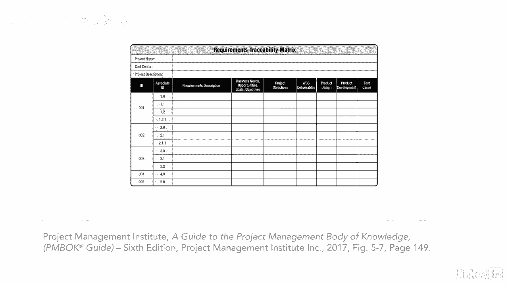

# 061-Lynda教程：项目管理专业人员(PMP)备考指南Cert Prep Project Management Professional (PMP) - P38：chapter_038 - Lynda教程和字幕 - BV1ng411H77g

当涉及到项目时，没有什么比了解利益相关者的需求更重要的了，假设你有一个利益相关者要求你建造一艘帆船，所以你生产这个，当他们真正想要的是这个，大家可以看到，必须收集所有的需求。

所以你可以做出利益相关者真正想要的东西，毕竟，你的利益相关者首先是你有一个项目的原因，你想让他们开心，收集需求是范围管理知识领域中的一个过程，是项目成功的基础，因为如果你不知道该建造什么。

你怎么知道该做什么，它属于计划过程组，包括产品的条件和能力等信息，比如它会有多高，成功的颜色，收集利益相关者的需求和期望是至关重要的，然后将它们转化为需求，让我们来看看这个过程的ittos。

这个过程有七个输入，第一个是项目管理计划，它有计划的输出，范围管理流程，规模管理计划，以及需求管理计划，加上利益相关者管理计划，接下来是项目文档，其中包括，学习寄存器，假设，日志，和利益相关者登记册。

利益相关者登记册是能够提供项目需求信息的利益相关者的列表，业务案例也作为输入包括在内，因为它描述了满足业务需求所必需的或可选的内容，然后我们有协议，其中包括项目或产品要求的信息。

此过程中的另一个输入是项目章程，其中包括对项目的高水平要求，一如既往，考虑作品和Eevs是很重要的，收集需求时，现在有八种工具和技术用于这个过程，让我们从专家判断开始，他们将帮助确定需求。

接下来是数据收集，这可能包括头脑风暴面试，问卷，焦点小组，和基准测试，它是将您的组织与另一个类似的组织进行比较，一旦你收集了数据，您需要在此过程中应用数据分析，它在分析其他文件，比如协议。

帮助确定需求的商业计划和营销文献，还有数据表示，它有助于通过思维导图或亲和力图来显示你的分析，在决策中使用了几种技术，它使用一个矩阵来应用一个系统的方法来评估和排名想法。

另一个技术工具是人际交往和团队技能，其中包括名义组技术，这将头脑风暴会议的结果从最高到最低进行排名，促进与集思广益、观察和对话也很有效，一个很好的工具是为公司原型。

这些天正在使用三维建模来建立他们产品的模型，为了及早收集反馈，技术上的最后一个工具是上下文关系图，我非常喜欢使用这种技术，下面是一个它看起来像什么的例子，这是作用域模型的一个示例。

它可视化地显示了一个业务流程，一定要检查收集的需求，工具和技术，有关这些工具和技术的其他详细信息的讲义，此过程有两个输出，需求文档显示了每个需求如何满足项目的业务需求。

需求可追溯性矩阵将实际的可交付成果与产品需求联系起来，该矩阵可采用表格格式，并将包括关于每一项要求的具体信息，追溯矩阵的开发考虑到了项目的需要，可以根据要跟踪的内容添加或减去列。

此表是可追溯性矩阵可能是什么样子的示例，也看看讲义中的一个例子，它已经填写了。

为了充分了解项目所需的工作，从涉众那里收集需求是至关重要的，这些要求纳入了时间表，成本，和高质量的知识领域，所以让它们尽可能准确是很重要的。

