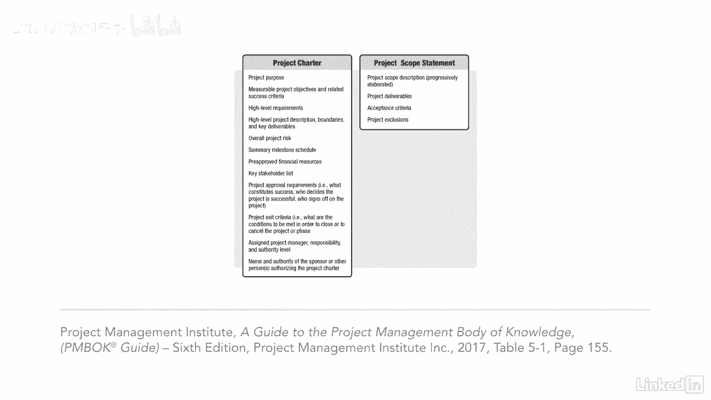

# 061-Lynda教程：项目管理专业人员(PMP)备考指南Cert Prep Project Management Professional (PMP) - P39：chapter_039 - Lynda教程和字幕 - BV1ng411H77g

项目经理通常认为项目的范围在需求之前是第一位的，但很难完全确定这个项目的范围，除非您首先收集并了解了这些要求，这就是为什么创建项目的范围语句很重要，从之前收集的需求。

项目的范围语句将包括范围内的所有内容，也可能列出超出范围的项目，如果它不在范围语句中，做不完，定义范围在规划过程组下，并且是进一步定义哪些需求在范围内和范围外的过程，产生了项目和产品的详细描述。

让我们来看看你更有可能被问到的问题，考题，对这一进程的三个关键投入是范围管理计划，项目章程和要求文件，范围管理计划提供了如何开发，监控项目范围，章程对项目进行了高水平的描述。

并可能包括需要包括在范围内的接受标准，第三个输入需求文档提供项目的所有需求，这将是项目范围内的一切，还有一个假设，为确定范围而需要查看的日志和风险登记册，最后的输入，Opus和Eevs是常见的输入。

应该在此过程中考虑，四个工具中的第一个是专家判断，接下来是那些生产产品的项目的产品分析，这包括产品分解等技术，替代品分析是下一个工具和技术，它还用于为您正在进行的项目生成其他选项，例如。

也许有另一种更便宜的解决办法，或者比你计划做的或决定外包的更快，而不是在家里做决策是另一个技术工具，您可以使用多标准决策分析，它提供了一个系统的方法来设置标准，如需求和资源。

技术上的最后一个工具是人际交往和团队技能，更具体地说，便利化，促进研讨会很好地让人们聚集在一起讨论项目，所以每个人都对项目目标有一个理解，最后，这个过程的输出是项目范围声明和项目文档更新，项目范围声明。

包括对项目范围的描述，主要交付成果清单，以及项目的任何假设或限制，在创建项目范围语句时，您可能意识到其他项目文件需要修改，我经常得到的问题是，项目章程和项目范围说明有什么区别，虽然有相似之处。

每个人的详细程度不同，这里的章程更高级，范围声明更具体，你可以看到每一个都包括什么和差异，项目范围说明，是帮助涉众理解项目范围的文档，它还提醒他们，在批准时，什么被认为超出了范围。

它包含了完成后接受产品的标准，这个项目的成功将取决于。