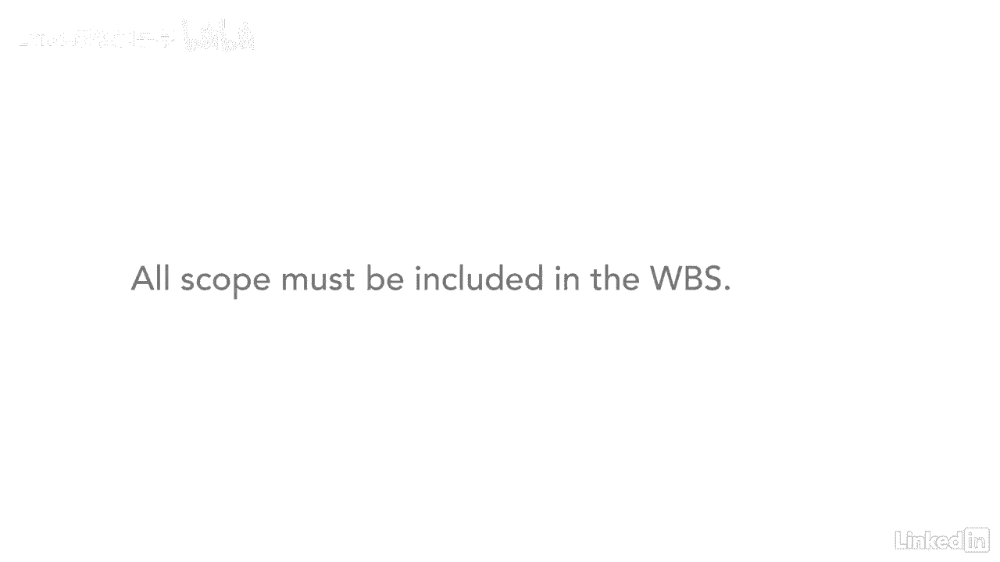

# 061-Lynda教程：项目管理专业人员(PMP)备考指南Cert Prep Project Management Professional (PMP) - P40：chapter_040 - Lynda教程和字幕 - BV1ng411H77g

我想让你想象一个南瓜派，当你想吃这个派的时候，你会把它捡起来，在中间做一个面部植物，然后开始吃吗，可能不会，除非你在参加吃派比赛，你可能会把它切成很多小块，所以更容易吃好，我们对项目也做同样的事情。

我们通过创建工作分解结构或wbs来分解工作，一个WBS，是一个图形化的层次结构图表，它采用项目的范围，分解成越来越小的碎片，称为工作包，创建工作分解结构过程属于计划过程组，让我们来看看关键的Itos。

你可能会在考试中被问到输入，你有范围管理计划是有道理的，项目范围说明和要求文件，所有这些都提供了将工作分解为更小部分所需的信息，其他输入，Eevs和opus是常见的输入，分解是关键工具，在这个过程中。

在这里，您可以将可交付的内容分解成越来越小的内容，可管理的工件，专家是帮助你解决这个问题的一个很好的资源，范围基线是此过程的主要输出，它包括项目的范围声明，工作分解结构与wbs词典，和工作包。

这是WBS的最低级别，有了这个成本和持续时间可以估计，并可以分配给个人或团体，范围基线还包括一揽子规划，它是WBS中的一个占位符，用于无法分解的工作，因为当时没有足够的信息，记住，每当你想到WBS时。

一定要包括WBS词典，这两个人总是在一起，就像兄弟姐妹一样，它伴随着WBS，并包含关于WBS上每个节点的附加信息，例如，它可能包括帐户ID代码等信息，工作的详细说明，责任方，里程碑是什么，以及验收标准。

另一个输出是更新受此过程影响的项目文档，现在让我向您展示工作分解结构是什么样子的，创建工作分解结构时，您总是从项目名称的顶部开始，然后将工作分解为单独的节点，例如，本例中的框，最高节点编号，从一号开始。

当节点被进一步分解时，数字细分为，例如，一分一，一点二还是一点三，然后一个点，一分一，一分，一点二，以此类推，给每个节点编号是很重要的，所以它可以被定位和识别，你可能想知道我要把范围分解到多远。

你想把范围分解到一个水平，你可以回答四个问题，首先，很难进一步分解一个工作包，其次是它足够小，可以估计持续时间，它是否足够小，可以估计成本，最后，它是否足够小，可以分配给一个人或一个团体。

当您开发WBS时，可能会有一些情况，你对一个节点的了解不够，无法分解它，那也没关系，当这种情况发生时，将这项工作作为占位符包含在WBS中是很重要的，这样工作就不会随着项目的进展而被遗忘。

越来越多的信息将变得明显，然后你可以分解未知的节点，要记住的一个重要注意事项是，所有作用域都包含在WBS中，如果它不包括在WBS中，还没做完。

每个工作包在一个wbs中只表示一次，一个工作包不能落在另一个节点下，它是相互排斥的，现在你知道什么是WBS了，以及如何创建一个，去试试吧，想想你正在做的一个项目，不管是私人的还是工作的。

