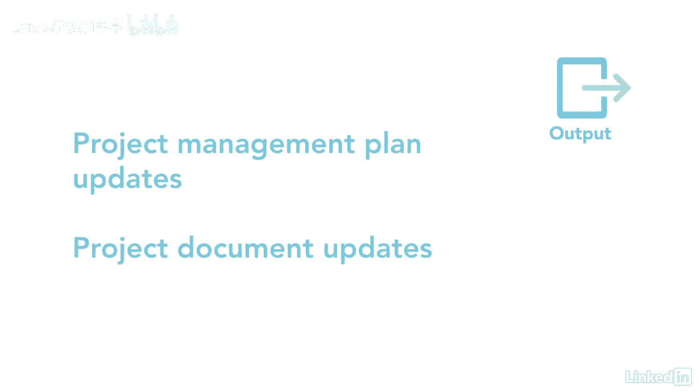

# 061-Lynda教程：项目管理专业人员(PMP)备考指南Cert Prep Project Management Professional (PMP) - P42：chapter_042 - Lynda教程和字幕 - BV1ng411H77g

想想当你在车里或智能手机上使用gps功能时，如果你偏离了航线或错过了一个转弯，GPS会自动纠正这一点，让你回到原来的路线，控制范围过程就像您遵循项目的时间表一样，但如果你开始偏离计划。

它有助于让你回到你的计划中，在这个过程中，您正在测量或检查项目的执行情况，你说过你会做的事，这也被称为计划与实际，例如，你在两周内完成了一项任务吗，由于计划控制范围属于监视和控制过程组。

这个过程真的能看到项目的执行情况吗，通过在项目中发生更改时监视项目和产品范围的状态，此过程确保范围基线得到维护，假设您正在监视您的项目，以衡量计划的和实际的，如果你发现一个方差，意思是你要么落后于计划。

要么花太多钱，您可能需要提交更改请求，以使流程回到您计划的状态，提交更改请求是通过将流程带回计划来控制流程，然后，变更请求应该通过执行集成的变更控制过程，如果项目或产品范围发生更改而没有经过。

执行集成变更控制，这会导致范围蠕变，以下是这个过程的ittos，大家可以看到，有很多输入和输出，但我们以前见过大多数，它们很常见，让我们更详细地讨论，你可能在考试中看到的。

两个关键的项目文档是需求文档和需求可追溯性矩阵，这些将帮助您衡量您是否满足确定的要求，另一份文件是经验教训登记册，另一个输入是工作绩效数据，这可能包括关于收到和接受的更改请求数量的信息。

项目在时间表上执行得有多好，或完成的交付品数量，请记住，当您有工作性能数据作为输入时，您总是将工作性能信息作为输出，以及更改请求，其余投入，项目管理计划和作品是常见的输入。

但你应该知道项目管理计划有范围，和配置管理计划，其中包括范围和性能基线，在这个过程中使用的一个工具是数据分析，包括方差和趋势分析，这些用于确定基线和实际性能之间的差异。

使用这种方法将帮助您了解差异有多严重，以及是否需要提交更改请求，四个输出中的第一个是工作绩效信息，这将告诉您项目在基线上的执行情况，以及两者之间的差异程度，取决于差异。

您可能需要提交更改请求以使项目回到计划中，因此，更改请求是这个过程的另一个输出，其他产出，项目经理计划更新和项目文档更新是常见的输出。

控制范围的详细说明，以及它是如何与更改请求紧密联系在一起的，并执行集成的变更控制过程，控制你已经建立的基线是很重要的，否则你就有偏离轨道的风险，然后你需要上一门课。

