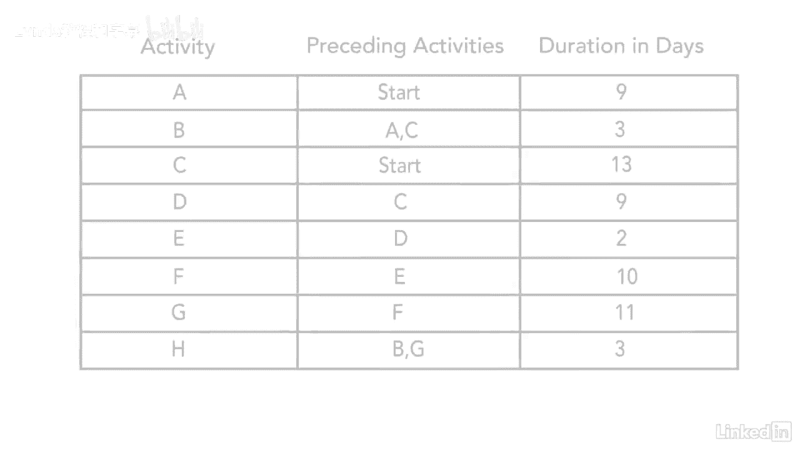
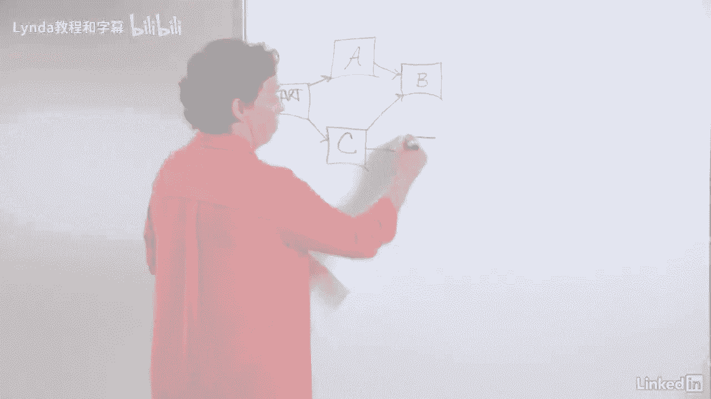
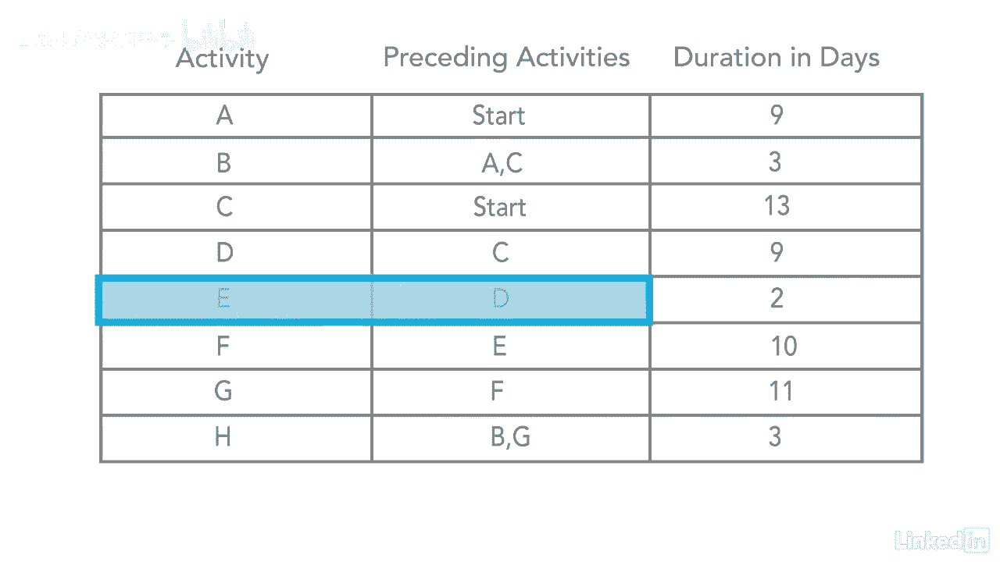
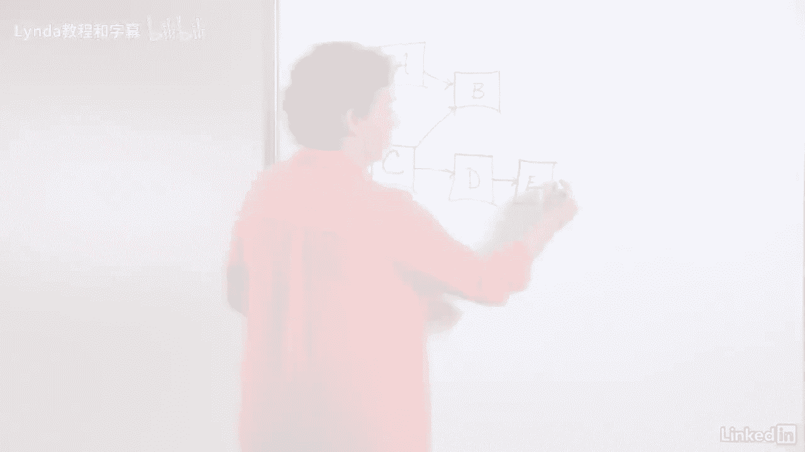
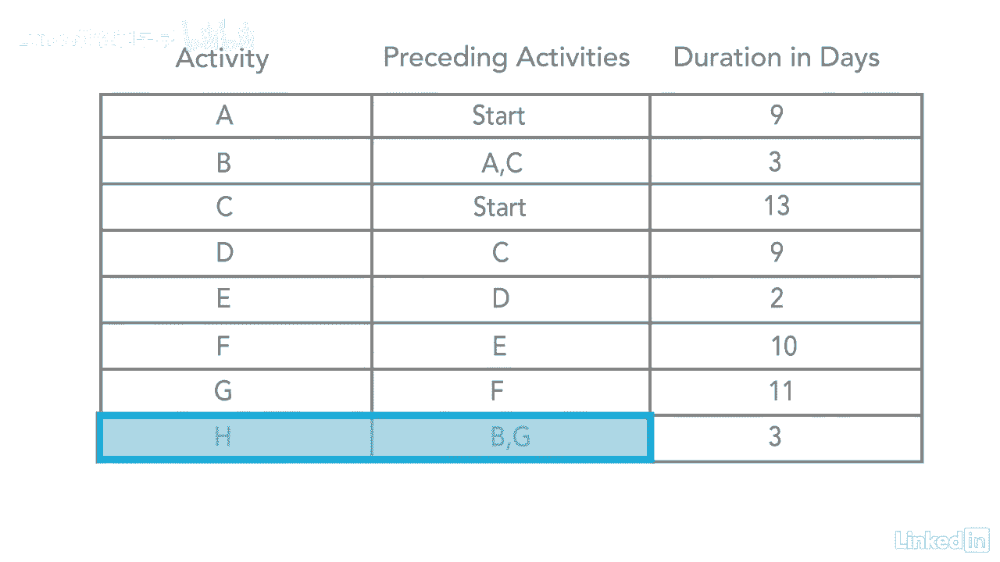
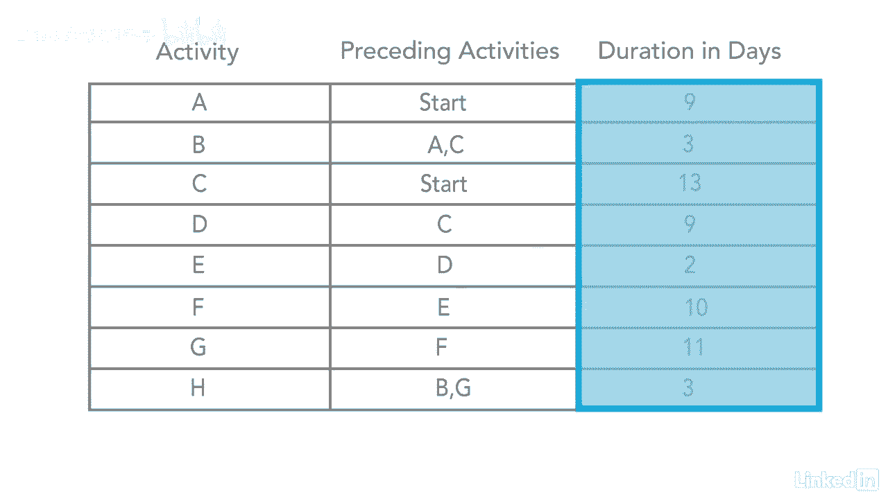

# 061-Lynda教程：项目管理专业人员(PMP)备考指南Cert Prep Project Management Professional (PMP) - P47：chapter_047 - Lynda教程和字幕 - BV1ng411H77g

所以在进度管理知识领域，我们将介绍创建网络图，让我们来看一个网络图的例子，所以在你面前的这张桌子上，你会看到有三个不同的列，在第一列中，你会看到它是活动a到h，这些是我们实际上要在网络图上创建的活动。

然后第二列有前面的活动，这将显示哪个节点将先于另一个节点，当我们创建网络图时，最后一栏只是给你几天的持续时间，对于我们要放在网络图上的每个不同节点，那么让我们开始吧，所以我们从左手边开始。

你总是从第一个节点开始你的网络图，也就是开始，然后如果你看着桌子，我看着好吧，a有start的前一个活动，所以如果你从开始的角度来看，然后你知道一个在开始之后，所以如果你看着这张桌子，你会看到活动。

A和C都是作为前驱开始的，所以我们知道这两者将同时开始，所以让我们继续在黑板上创建这两个节点，好啦，所以我们有一个，我们有c，所以开始进行a和c，所以你就去桌子上的下一个，这将是B，所以如果你看它。

它说b前面有a和c，所以这意味着它可能会在这里的中间，所以你会说，像这样，好啦，然后C我们已经处理好了，下一个是d，它说d之前有c。

所以我们知道我们必须这么做。

好吧，那么，如果你看e，它说e前面有d，所以我们就在这里继续。

下一个是f f前有e。

然后g前面有f，然后我们有h，它的前面是b和g。

既然上面有b，下面有g，我们把h放在中间，在这上面，好啦，然后你总是完成你的项目，所以我们必须从一开始就从这里开始，你有最后的结局，既然你想完成这个项目，H是你在这个项目中的最后一项活动，H会进去完成。

像这样，这就是网络图的样子，所以希望你在画这个的时候，和我一起，网络图最后是这样的，所以接下来我们要做的就是，我们必须加上这里的最后一列有几天的持续时间，所以你只要去参加每一个活动。

你会把持续时间写在上面。

所以对于一个，它是九，九总是在每个节点的中心，然后b是三，G是十一，h是三，好啦，你一定要确保，当你在上面输入时长的时候，你把它放在中间，因为我们要把左手边的数字加起来，在右手边。

你要确保你有足够的空间，那样，当你经历的时候，你不会混淆数字是什么。