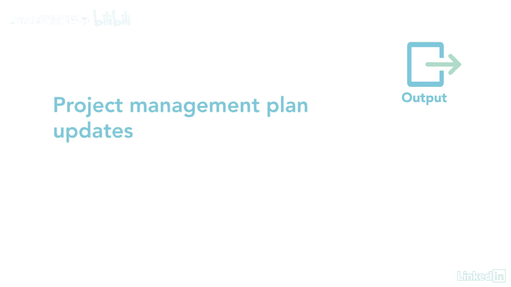

# 061-Lynda教程：项目管理专业人员(PMP)备考指南Cert Prep Project Management Professional (PMP) - P49：chapter_049 - Lynda教程和字幕 - BV1ng411H77g

以前过程中的所有艰苦工作都反馈到开发计划过程中，这个过程是一个很大的过程，它有二十个不同的ittos，工作量很大，但最终看到项目的时间表是值得的，制定的时间表过程属于规划过程组。

您从以前的过程中获取信息，喜欢的活动，持续时间，资源和依赖关系，并制定项目时间表，其结果是一个带有完成活动的计划日期的时间表，这里的项目是这个过程的ittos，第一个关键输入是进度管理计划。

它告诉你如何制定时间表，以及使用哪种工具，下一个输入是范围基线，它有来自WBS的信息，WBS，字典和范围声明，有几份项目文件作为投入，我会把重点放在那些你可能要测试的东西上，包括活动列表。

活动属性和持续时间估计，这些很重要，因为它们列出了活动，它们的细节和持续时间，另一个输入是网络图，显示了顺序，活动将完成，其次是资源需求，它确定每个活动所需的资源，资源日历和项目团队分配。

当他们有空的时候，说出被分配到每个活动的人的名字，在多长时间内，另一个输入是风险登记册，这提供了风险及其详细信息的列表，可能会影响日程安排，一定要回顾一下假设，估计数的对数基础，经验教训登记册协定。

和里程碑列表，这个过程的第一个工具和技术是调度网络分析，这是一种识别早期和晚期开始日期的技术，以及每个活动的早期和晚期完成日期，也称为向前和向后传球，完成时，生成项目时间表，接下来是关键路径法。

或者CPM，它在图中计算最长的路径，表示项目可以完成的最短时间，它还在时间表中寻找灵活性，也被称为浮子，其次是资源优化，它根据资源的供求调整时间表，例如资源均衡和平滑，另一个工具是数据分析。

其中包括假设情景分析，这是评估情景的过程，为了预测它们对项目目标和模拟的影响，它把你的日程表上传到一台运行数百甚至数千台的计算机上，尝试在你的时间表中识别未知的风险，这方面的一个例子是蒙特卡洛分析。

另一个关键工具和技术是领先和滞后计划压缩，也是一种在不缩小项目范围的情况下缩短进度持续时间的技术，下面是这种技术的两个例子，崩溃是当您向非活动添加资源以缩短其持续时间时，这只适用于关键路径上的活动。

还有额外的成本，有快速追踪，这是当您将活动移动到比计划更早开始时，例如，与其他活动平行或重叠，这只适用于关键路径上的活动，而且还有额外的风险，下一个工具是采购经理人指数，它有用来创建时间表的软件。

最后是敏捷发布计划，这提供了一个高水平的发布时间表，这包括完成项目所需的迭代次数，下面是一个例子，说明这可能是什么样子的，每个版本显示提供给客户的迭代和特性的数量，这一进程有七项产出。

第一个是时间表基线，哪一份是经过批准的时间表，接下来是项目进度，这通常是时间表的图形表示，而且可以用很多方式来表示，包括柱状图，里程碑图表，和网络图，另一个输出是计划数据，其中包括所需资源的支持细节。

最佳或最坏情况，和时间表储备，另一个输出是项目日历，这些标识可用于预定活动的工作日和班次，下一个关键输出是更改请求，最后两个产出是项目管理计划更新和项目文件更新。

开发的进度过程对项目至关重要，知道团队将在什么时候以及工作多长时间是很重要的，所以现在，是时候好好利用你所有的辛苦工作了。

