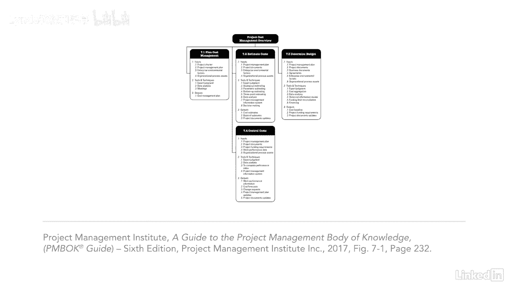

# 061-Lynda教程：项目管理专业人员(PMP)备考指南Cert Prep Project Management Professional (PMP) - P54：chapter_054 - Lynda教程和字幕 - BV1ng411H77g

在我们开始之前，让我告诉你，项目成本管理知识领域似乎令人望而生畏，因为所有的公式，就连我也承认我有点被吓倒了，但一旦我学会了公式，那是微风，当我们完成这个知识区域的时候，你会对过程有更好的理解。

更不用说公式会在公园里散步，项目成本管理知识领域的流程，将帮助您计算出每个活动的资源成本，然后你可以制定预算，确定你什么时候能得到资金，并决定如何管理和控制预算，记住每个过程都需要按顺序进行。

因为您收集的信息将在下面的过程中使用，您将看到这个知识区域有很多ittos，我不建议大家都死记硬背，我的建议是了解这些过程是如何相互流动的，作为输入有意义的是什么。

工具和产出，现在您已经从一个较高的层次了解了项目成本管理知识领域。