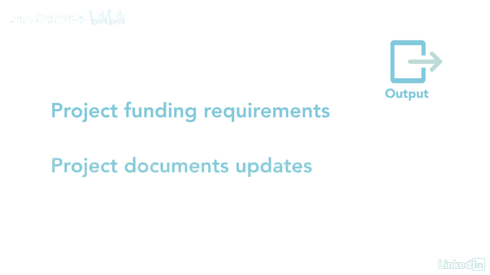

# 061-Lynda教程：项目管理专业人员(PMP)备考指南Cert Prep Project Management Professional (PMP) - P57：chapter_057 - Lynda教程和字幕 - BV1ng411H77g

我记得我第一次买车，我没有足够的钱直接买下它，所以我不得不看看这辆车的总成本，那么我每个月有多少钱加上费用，然后我做了一个预算来每月付款，这几乎正是在确定的预算过程中发生的事情。

只不过钱是公司的不是你的，让我们来看看这个过程需要什么，确定的预算属于规划过程组，这是当每个活动或工作包的成本相加时，确定核定预算和费用基准，了解项目预算和成本基准之间的区别是很重要的。

项目预算是用于执行项目的资金，费用基线为核定的分阶段项目预算，让我解释一下我所说的时间阶段预算是什么意思，好啦，一旦你确定了预算，比如说四百万，公司不会在项目的第一天就给你400万美元，在项目实施期间。

他们将定期提供资金，当需要的时候，您的时间阶段预算，告诉他们你什么时候需要这些资金，您可以看到此过程的ittos，让我们复习一下你在考试中可能看到的，第一个投入是成本管理计划。

它详细说明了如何管理此过程，范围基线是下一个，并包括项目的范围声明，WBS和WBS词典，资源管理计划提供关于其他资源费用的信息，如差旅费和每一资源的费率，例如，承包商每小时收费200美元和任何其他费用。

有几个项目文件需要考虑，从估计数的基础开始，它是支持每个活动的成本估计的信息，项目时间表显示了活动的开始和停止日期，以及它们如何输入工作包，这使得预算的时间阶段更容易，所以资金在需要的时候是可用的。

风险登记册很重要，因为可能会有与风险应对相关的成本，费用也包括在资源等协议中，产品或服务，需要审查的另外两份文件是企划案和效益管理计划，最后一个输入是fs和opas，第一个工具和技术是成本聚合。

当你把每个活动的成本加起来，这就变成了工作包的总成本，每个工作包为整个项目相加，费用准备金分析是用于建立应急和管理准备金的数据分析工具，管理储备到位，以应对任何意外工作，另一个工具是历史信息审查。

它使用参数和类似的估计资金限额，和解，查看一个项目在一段时间内可能存在的资金限制，活动可能需要推迟或重新安排到有资金的时候，另一个是融资，得到项目所需的资金，最后一个工具现在是专家判断。

这个过程的第一个输出是成本基线，哪一个是经过批准的，但不包括管理储备金，成本基线和预算之间可能有些混淆，让我通过分解整个项目预算来澄清它，开始每项活动的费用，在风险管理过程中。

还为那些有应对计划的国家增加了应急准备金，一旦完成，然后将所有活动成本加起来，形成一个总的工作包和应急成本，将两者相加得出控制帐户，然后成为成本基线。

管理准备金是为支付任何其他风险或未知费用而增加到项目中的额外资金，这些储备金是在接下来的费用基线之外的，你拿成本基线，并添加管理储备金以得出项目总预算，项目资金需求是另一项主要产出。

它提供了项目所需的全部资金，以及何时需要定期资金来执行项目，最后一个输出是项目文档更新。

拥有一个经批准的时间阶段预算和成本基线对项目至关重要，因为它有助于组织计划何时为项目提供资金。