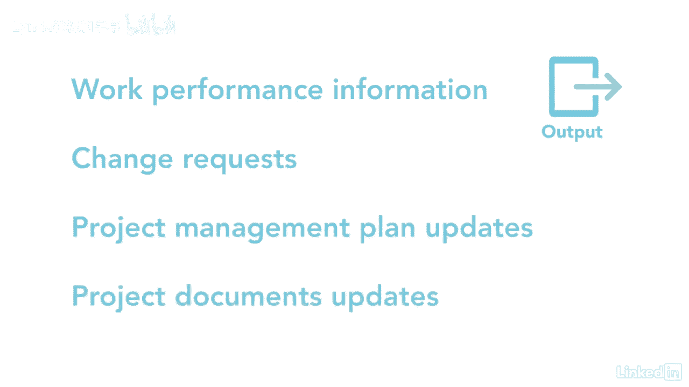

# 061-Lynda教程：项目管理专业人员(PMP)备考指南Cert Prep Project Management Professional (PMP) - P58：chapter_058 - Lynda教程和字幕 - BV1ng411H77g

想想上次你试图平衡支票簿，你看银行对账单，并将其与支票簿登记簿进行比较，确保一切都有记录，记下任何未完成的交易是很重要的，这样你就不会超支了，你很清楚你的账户里有多少钱，控制成本的过程与此相似。

你得到了这个项目的预算，你的工作就是确保你不会，你还想确保你从正在执行的工作中获得价值，控制成本属于监控过程组，并且是监控项目状态的过程来更新项目成本，以及成本基准，此过程使用挣值公式来识别差异。

如果发现一个，你需要在这里纠正它，您可以看到此过程的ittos，让我们回顾一下关键的，第一个投入由成本管理计划组成，费用基线和业绩计量基线，这三者都将帮助您确定计划中的和实际的，以查看是否需要更改。

其次是项目资金需求，包括预计支出，加预期负债，记住，工作性能数据是从当前正在完成的工作中收集的原始数据，如发生或开具发票的费用，最后的投入是回顾经验教训，学会了，注册和OPA。

四种工具和技术中的第一种是数据分析，它使用挣值等工具，差异趋势和准备金分析，这些方法中的每一个都有助于项目经理了解项目的性能，通过观察挣得价值和比较计划与实际，我建议查看控件。

有关挣值和方差分析的详细信息的成本讲义，您可以看到赚取价值和计划与实际之间的比较，该项目表明其实际费用高于计划，所以超出预算了，而且它的挣值比计划的要少，所以进度落后了。

另一个工具是完成性能指标或tcpi，这是对性价比的预测，为了满足原计划，团队需要开会，例如，如果tcpi高于1，例如：1点2分5秒，然后团队需要想办法救两个，一美元五分，向前推进以满足原计划预算。

最后的工具是专家判断和采购经理人指数，pmis是保存软件的地方，用来跟踪挣值计算的，这一进程有五项产出，主要产出之一是成本预测，这些告诉你完成时的估计和对完成值的估计，传达给利益相关者，完成时估计数。

预测项目的最终成本，如果性能保持不变，直到项目结束，对完成情况的估计表明，到目前为止，你已经花了一定的钱，你还要花多少钱才能完成这个项目？记住工作性能数据作为输入意味着工作性能信息是输出，以及更改请求。

其余的产出是项目管理计划更新和项目文件更新。

控制成本对确保你走上正轨至关重要，并确保有足够的钱支付支票。