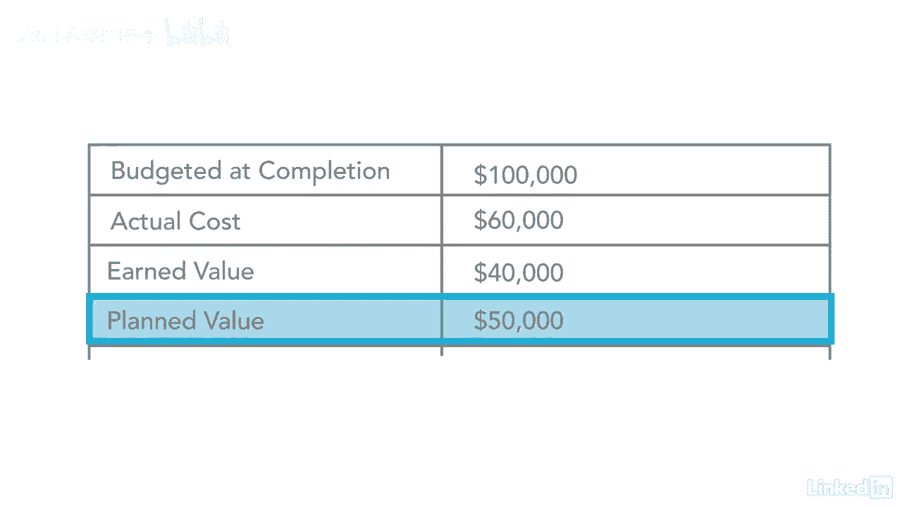

# 061-Lynda教程：项目管理专业人员(PMP)备考指南Cert Prep Project Management Professional (PMP) - P59：chapter_059 - Lynda教程和字幕 - BV1ng411H77g

因此，我们已经在成本管理知识领域介绍了挣值管理，但我想做的是复习一个示例问题，就像你在考试中看到的，第一个视频我们要做的是，我们要把这个分开，所以你可以在这里看到，我们有BAC电动车赚取价值。

计划值PV，我们要先讨论这四个公式，然后下一个视频我们要涵盖接下来的四个，然后第三个视频，我们将讨论接下来的四个公式，所以让我们开始吧，所以我们可能会讨论的一个问题的例子，如果你看看这个例子。

上面说你有一个建筑项目要在12个月内完成，这个项目的总成本是十万美元，六个月过去了，你花了六万美元和一个时间表，他说百分之五十的工作应该在更仔细的审查后完成，你发现只完成了百分之四十的工作。

所以这里有几件事你可以马上注意到，因为我们将从这里的前四个数字开始，好啦，所以我们要做的是计算出完成时的预算，这是项目的总预算，我们想知道到目前为止的实际成本是多少。

然后是到目前为止你所获得和完成的工作的实际挣得价值，然后计划评估到目前为止您期望完成的内容，当我们看到这四个，一旦你有了这四个人的号码，这些都将插入以下公式，所以首先得到这些并了解它们是什么是很重要的。

然后剩下的就是一个瞬间，所以如果你看这个例子，我们可以自动得到的第一个数字，上面说这个项目的总成本是十万美元，他们已经帮你弄明白了，所以你要做的就是把号码写在这里，这是你完成时的预算。

总共要花费你十万美元，所以下一个很容易算出来的数字，是不是说六个月过去了，你花了六万美元，这就是实际成本，这就是你六个月来约会的花费，所以在这里，上面写着实际成本，所以你可以把这个数字代入6万。

所以这是两个数字，你能够在阅读页面上的场景的几秒钟内得到，那么让我们来看看挣得价值和计划价值，所以当你看挣得的价值时，它查看已完成工作的实际百分比，乘以BAC，所以挣得的价值是你到目前为止实际完成的。

那份工作的价值是什么，它说六个月过去了，你花了6万美元，日程表上说50%的工作应该在仔细审查后完成，你发现只完成了百分之四十的工作，所以当你看到这个，它告诉你，你只完成了十万个中的百分之四十。

所以你只要取实际完成的百分比，是背鳍的40倍，它看起来是这样的，所以你的预算是十万完成的百分比是零点四，好啦，所以你拿点4 0乘以10万，然后这就给了你实际的挣值，总共四万，所以现在我们有四个中的三个。

下一个我们需要做的是你的计划值，这告诉你在这个时候你计划做多少工作，所以计划百分比，完整时间，完成时的预算，所以我们计划完成50%的工作，所以你拿百分之五十，也就是五点零，倍BAC，也就是十万。

E等于五万，所以几分钟之内，我们实际上能够在完成时得到所有四个变量的预算，你的实际成本，你的赚取价值，你的计划价值仅仅是看我们在你面前的场景。

所以你有了。