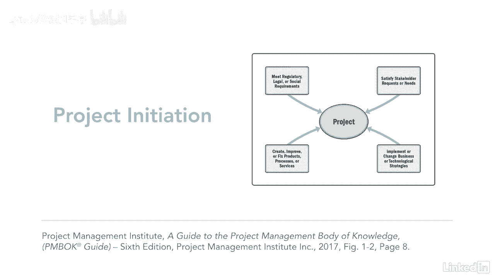

# 061-Lynda教程：项目管理专业人员(PMP)备考指南Cert Prep Project Management Professional (PMP) - P5：chapter_005 - Lynda教程和字幕 - BV1ng411H77g

如果你非常想知道为什么项目管理如此重要，你来对地方了解项目管理，当你运用你的知识技能，满足项目要求的预定活动的工具和技术，但这到底意味着什么，这意味着你在遵循项目管理流程，在整个课程中你们会非常熟悉。

因此您可以更有效地管理您的项目，正确地管理一个项目有一些真正的好处，包括满足业务目标和将项目结果与业务目标联系起来，您还将满足涉众的需求和期望，你可以更快地解决问题和问题，增加成功的机会，以此类推。

另一个关键好处是组织能够适应变化，允许他们在另一方面快速修改项目管理计划，如果你不能正确地管理项目，你可能会错过最后期限，费用超支，而且质量差，导致利益相关者不满意，从来都不是好事。

现在您已经坚定地理解了项目管理的重要性，让我们来谈谈什么是项目开始一个项目是暂时的努力，有明确的开始和结束日期，它还产生了独特的产品服务或结果，或者三者的结合。

这方面的一个很好的例子可能是实现一个新的文档管理系统，它产生了这三个项目，一个项目可以是社会的，经济，材料，或环境，就其性质而言，这可能会持续到项目结束后，例如，在河上建一座桥可能会节省通勤时间。

从而帮助一个社区，并提供更快的服务或社区活动，它还有助于减少对河流的环境影响，所有这些都会持续到项目结束后，知道一个项目什么时候完成也很重要，这里有一些迹象，首先是当它的所有目标都实现了。

以及利益相关者的期望，有时项目比计划结束得更早，当决定不再需要这项工作时，目标无法实现，或者当资源不再可用且持续时，项目也可以因法律原因终止，在此图中，项目的主要目的是推动组织的变化。

您可以看到组织在项目之前处于其当前状态，一旦项目完成，它使公司进入了一个未来的状态，这种未来状态应该通过节省组织的时间和金钱来增加业务价值，或提供商品和服务，商业价值是你在谈论项目时经常听到的一个术语。

但它通常用于描述特定项目的好处，但实际上远不止于此，每个组织的业务价值都是不同的，它是所有有形和无形元素的总和，有形物品的例子可以是货币资产或固定装置，就像你在装配线上看到的用来保存和测试产品的。

公司或公用事业公司也有股东权益，建筑物和设备，无形资产可能包括善意，公司的声誉和品牌知名度，也有公共利益或商标和战略联盟，这张图显示了，项目启动的四个原因。

这些类型的项目中的每一种都可以为组织增加业务价值，并帮助正在进行的操作，通过正确管理日常运营可以产生业务价值，或者通过有效地使用投资组合。

方案和项目管理，通过使用可靠的既定流程，企业可以通过项目投资获得更大的商业价值，了解什么是或不是一个项目是项目管理的一个很好的开始，评估您的项目也有很好的商业意义，看看它们是否与公司目标一致。

并且正在满足一些业务需求--遵循既定的、经过验证的项目管理流程的组织。